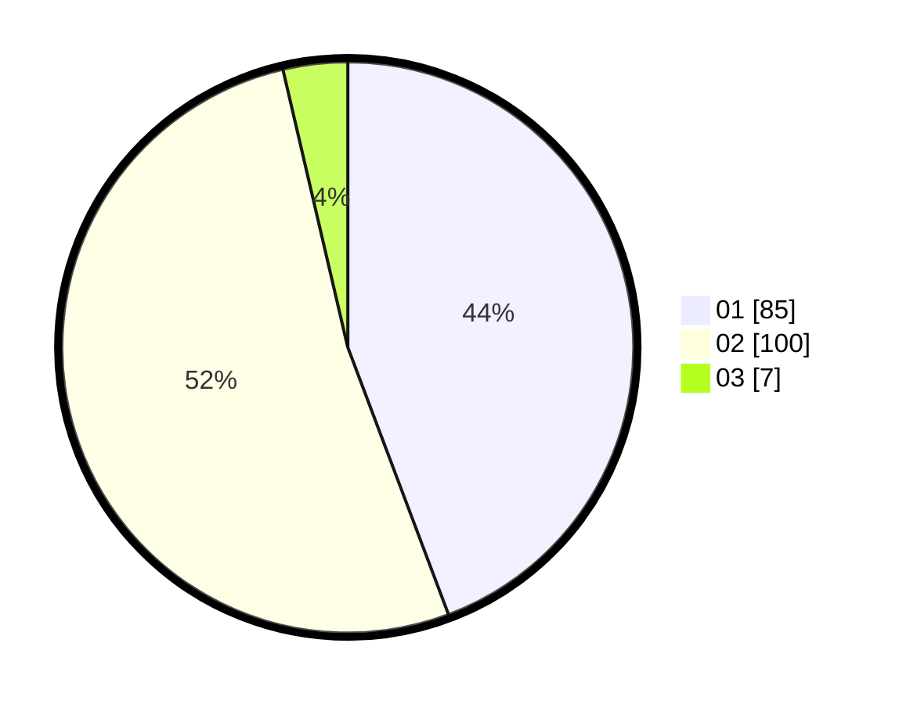

# Hasil

Hasil perolehan suara paslon dapat dilihat pada file paslon-01.txt, paslon-02.txt, dan paslon-03.txt.

Jika tidak ada, artinya data tersebut belum ada pada SIREKAP.

## Perolehan Suara

 * Paslon 01: **85**.
 * Paslon 02: **100**.
 * Paslon 03: **7**.

## Foto C Plano

https://sirekap-obj-formc.kpu.go.id/7c6d/pemilu/ppwp/31/72/01/10/02/3172011002013-20240216-203103--3e3997a6-3c55-4f0b-9b02-3c52f12a15b1.jpg

https://sirekap-obj-formc.kpu.go.id/7c6d/pemilu/ppwp/31/72/01/10/02/3172011002013-20240216-203136--2de279ec-8a4d-43fd-b28c-31c66222891f.jpg

https://sirekap-obj-formc.kpu.go.id/7c6d/pemilu/ppwp/31/72/01/10/02/3172011002013-20240216-203319--af947d05-38d2-43a9-826b-c27ef5a09ad1.jpg

## DATA PEMILIH TETAP

Jumlah pemilih dalam DPT: **248**.
 * L: **127**.
 * P: **121**.

## DATA PENGGUNA HAK PILIH

Jumlah pengguna hak pilih dalam DPT: **193**.
 * L: **95**.
 * P: **98**.

Jumlah pengguna hak pilih dalam DPTb: **0**.
 * L: **0**.
 * P: **0**.

Jumlah pengguna hak pilih dalam DPK: **2**.
 * L: **1**.
 * P: **1**.

Jumlah pengguna hak pilih: **195**.
 * L: **96**.
 * P: **99**.

## JUMLAH SUARA SAH DAN TIDAK SAH

JUMLAH SELURUH SUARA SAH: **192**.

JUMLAH SUARA TIDAK SAH: **3**.

JUMLAH SELURUH SUARA SAH DAN SUARA TIDAK SAH: **195**.
