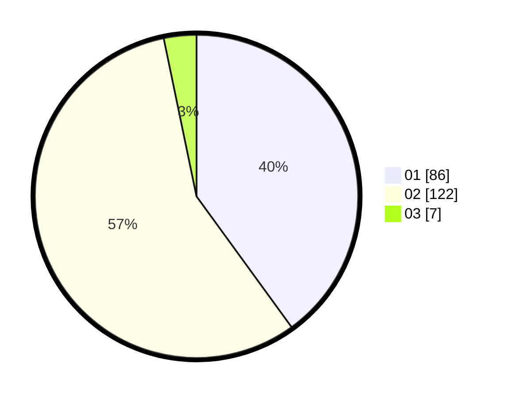

# Hasil

Hasil perolehan suara paslon dapat dilihat pada file paslon-01.txt, paslon-02.txt, dan paslon-03.txt.

Jika tidak ada, artinya data tersebut belum ada pada SIREKAP.

## Perolehan Suara

 * Paslon 01: **86**.
 * Paslon 02: **122**.
 * Paslon 03: **7**.

## Foto C Plano

https://sirekap-obj-formc.kpu.go.id/804a/pemilu/ppwp/31/72/01/10/02/3172011002016-20240216-210912--19d4e126-59bb-4d44-9349-bb8705e5fad1.jpg

https://sirekap-obj-formc.kpu.go.id/804a/pemilu/ppwp/31/72/01/10/02/3172011002016-20240216-210943--366841ed-e050-456c-a793-13525f046c52.jpg

https://sirekap-obj-formc.kpu.go.id/804a/pemilu/ppwp/31/72/01/10/02/3172011002016-20240216-211006--de5a44b4-5a21-4b59-a55f-10cbbe770d71.jpg

## DATA PEMILIH TETAP

Jumlah pemilih dalam DPT: **251**.
 * L: **132**.
 * P: **119**.

## DATA PENGGUNA HAK PILIH

Jumlah pengguna hak pilih dalam DPT: **220**.
 * L: **115**.
 * P: **105**.

Jumlah pengguna hak pilih dalam DPTb: **0**.
 * L: **0**.
 * P: **0**.

Jumlah pengguna hak pilih dalam DPK: **0**.
 * L: **0**.
 * P: **0**.

Jumlah pengguna hak pilih: **220**.
 * L: **115**.
 * P: **105**.

## JUMLAH SUARA SAH DAN TIDAK SAH

JUMLAH SELURUH SUARA SAH: **215**.

JUMLAH SUARA TIDAK SAH: **5**.

JUMLAH SELURUH SUARA SAH DAN SUARA TIDAK SAH: **220**.
