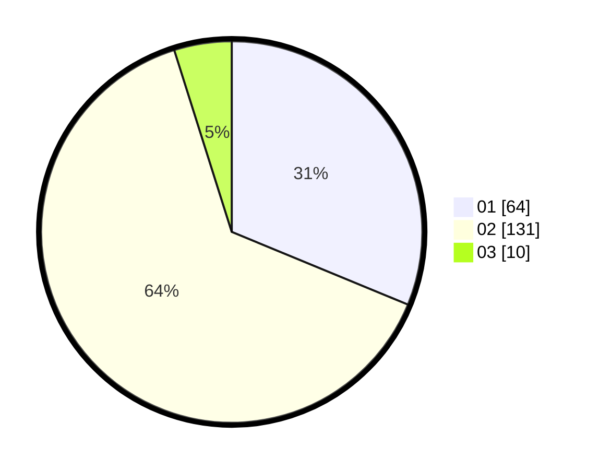

# Hasil

Hasil perolehan suara paslon dapat dilihat pada file paslon-01.txt, paslon-02.txt, dan paslon-03.txt.

Jika tidak ada, artinya data tersebut belum ada pada SIREKAP.

## Perolehan Suara

 * Paslon 01: **64**.
 * Paslon 02: **131**.
 * Paslon 03: **10**.

## Foto C Plano

https://sirekap-obj-formc.kpu.go.id/37d7/pemilu/ppwp/31/72/01/10/02/3172011002019-20240216-212517--23bc4fbb-f726-4f1e-80e1-da8cbd1d0759.jpg

https://sirekap-obj-formc.kpu.go.id/37d7/pemilu/ppwp/31/72/01/10/02/3172011002019-20240216-212601--5dc3c24c-66fb-47ca-b655-2796c06b7141.jpg

https://sirekap-obj-formc.kpu.go.id/37d7/pemilu/ppwp/31/72/01/10/02/3172011002019-20240216-212644--d27f83b4-620b-4012-bdf0-c665aefeb17d.jpg

## DATA PEMILIH TETAP

Jumlah pemilih dalam DPT: **245**.
 * L: **130**.
 * P: **115**.

## DATA PENGGUNA HAK PILIH

Jumlah pengguna hak pilih dalam DPT: **211**.
 * L: **111**.
 * P: **100**.

Jumlah pengguna hak pilih dalam DPTb: **0**.
 * L: **0**.
 * P: **0**.

Jumlah pengguna hak pilih dalam DPK: **6**.
 * L: **1**.
 * P: **5**.

Jumlah pengguna hak pilih: **217**.
 * L: **112**.
 * P: **105**.

## JUMLAH SUARA SAH DAN TIDAK SAH

JUMLAH SELURUH SUARA SAH: **205**.

JUMLAH SUARA TIDAK SAH: **12**.

JUMLAH SELURUH SUARA SAH DAN SUARA TIDAK SAH: **217**.
