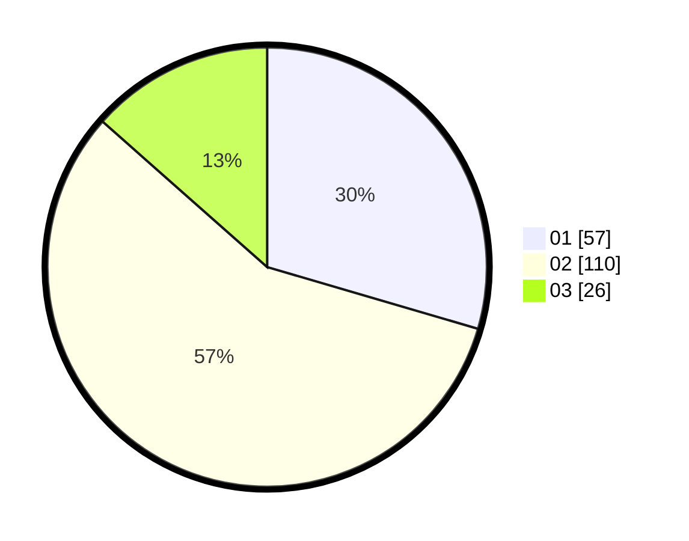

# Hasil

Hasil perolehan suara paslon dapat dilihat pada file paslon-01.txt, paslon-02.txt, dan paslon-03.txt.

Jika tidak ada, artinya data tersebut belum ada pada SIREKAP.

## Perolehan Suara

 * Paslon 01: **57**.
 * Paslon 02: **110**.
 * Paslon 03: **26**.

## Foto C Plano

https://sirekap-obj-formc.kpu.go.id/575a/pemilu/ppwp/31/72/01/10/02/3172011002023-20240217-112334--08a31b3c-c97c-4b76-baa2-411c36344cd1.jpg

https://sirekap-obj-formc.kpu.go.id/575a/pemilu/ppwp/31/72/01/10/02/3172011002023-20240217-112946--1681ce46-a3b2-47fc-9819-e039a99562bc.jpg

https://sirekap-obj-formc.kpu.go.id/575a/pemilu/ppwp/31/72/01/10/02/3172011002023-20240217-113214--8ced5307-2197-463e-9e52-313ed8f6031c.jpg

## DATA PEMILIH TETAP

Jumlah pemilih dalam DPT: **236**.
 * L: **118**.
 * P: **118**.

## DATA PENGGUNA HAK PILIH

Jumlah pengguna hak pilih dalam DPT: **175**.
 * L: **86**.
 * P: **89**.

Jumlah pengguna hak pilih dalam DPTb: **11**.
 * L: **4**.
 * P: **7**.

Jumlah pengguna hak pilih dalam DPK: **10**.
 * L: **3**.
 * P: **7**.

Jumlah pengguna hak pilih: **196**.
 * L: **93**.
 * P: **103**.

## JUMLAH SUARA SAH DAN TIDAK SAH

JUMLAH SELURUH SUARA SAH: **193**.

JUMLAH SUARA TIDAK SAH: **3**.

JUMLAH SELURUH SUARA SAH DAN SUARA TIDAK SAH: **196**.
