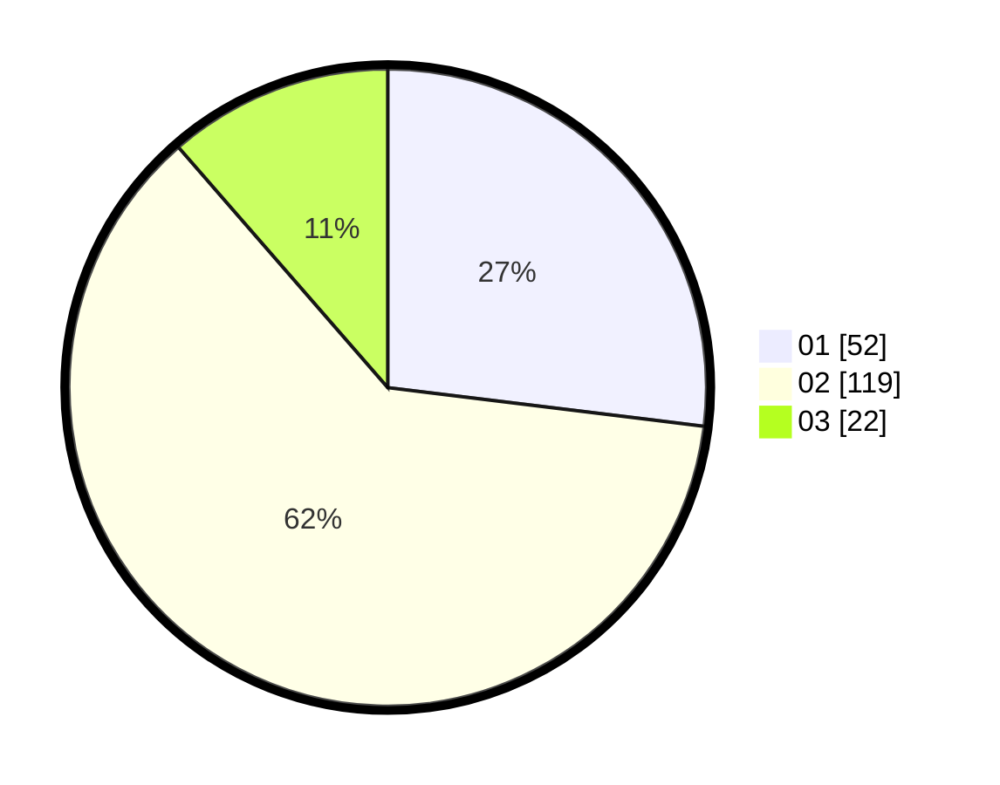

# Hasil

Hasil perolehan suara paslon dapat dilihat pada file paslon-01.txt, paslon-02.txt, dan paslon-03.txt.

Jika tidak ada, artinya data tersebut belum ada pada SIREKAP.

## Perolehan Suara

 * Paslon 01: **52**.
 * Paslon 02: **119**.
 * Paslon 03: **22**.

## Foto C Plano

https://sirekap-obj-formc.kpu.go.id/4dc8/pemilu/ppwp/31/72/01/10/02/3172011002024-20240217-105524--ef31a9e7-9e0a-4fd6-a53a-02dead8ea04b.jpg

https://sirekap-obj-formc.kpu.go.id/4dc8/pemilu/ppwp/31/72/01/10/02/3172011002024-20240217-105603--6f8b1d21-0bad-4fdb-8528-1b7abeeee861.jpg

https://sirekap-obj-formc.kpu.go.id/4dc8/pemilu/ppwp/31/72/01/10/02/3172011002024-20240217-105706--9810a96d-bbcf-4159-8ebf-48442493dddc.jpg

## DATA PEMILIH TETAP

Jumlah pemilih dalam DPT: **241**.
 * L: **119**.
 * P: **122**.

## DATA PENGGUNA HAK PILIH

Jumlah pengguna hak pilih dalam DPT: **189**.
 * L: **91**.
 * P: **98**.

Jumlah pengguna hak pilih dalam DPTb: **7**.
 * L: **2**.
 * P: **5**.

Jumlah pengguna hak pilih dalam DPK: **6**.
 * L: **2**.
 * P: **4**.

Jumlah pengguna hak pilih: **202**.
 * L: **95**.
 * P: **107**.

## JUMLAH SUARA SAH DAN TIDAK SAH

JUMLAH SELURUH SUARA SAH: **193**.

JUMLAH SUARA TIDAK SAH: **9**.

JUMLAH SELURUH SUARA SAH DAN SUARA TIDAK SAH: **202**.
