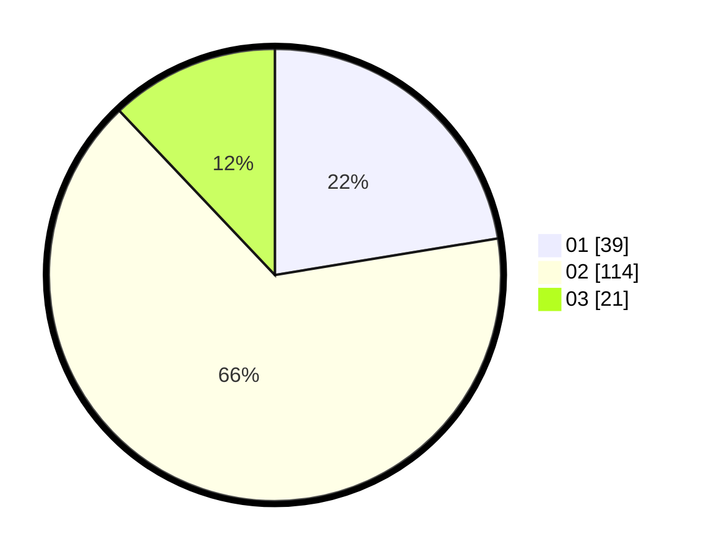

# Hasil

Hasil perolehan suara paslon dapat dilihat pada file paslon-01.txt, paslon-02.txt, dan paslon-03.txt.

Jika tidak ada, artinya data tersebut belum ada pada SIREKAP.

## Perolehan Suara

 * Paslon 01: **39**.
 * Paslon 02: **114**.
 * Paslon 03: **21**.

## Foto C Plano

https://sirekap-obj-formc.kpu.go.id/6926/pemilu/ppwp/31/72/01/10/02/3172011002025-20240217-114534--9d854cf7-42de-4cc4-8c8b-52be7e92a1d4.jpg

https://sirekap-obj-formc.kpu.go.id/6926/pemilu/ppwp/31/72/01/10/02/3172011002025-20240217-114621--5830c318-984b-492c-9cb1-1b587bce832a.jpg

https://sirekap-obj-formc.kpu.go.id/6926/pemilu/ppwp/31/72/01/10/02/3172011002025-20240217-114751--0a053f69-1e05-482b-ac42-d3768680f80a.jpg

## DATA PEMILIH TETAP

Jumlah pemilih dalam DPT: **171**.
 * L: **80**.
 * P: **91**.

## DATA PENGGUNA HAK PILIH

Jumlah pengguna hak pilih dalam DPT: **171**.
 * L: **80**.
 * P: **91**.

Jumlah pengguna hak pilih dalam DPTb: **6**.
 * L: **1**.
 * P: **5**.

Jumlah pengguna hak pilih dalam DPK: **0**.
 * L: **0**.
 * P: **0**.

Jumlah pengguna hak pilih: **177**.
 * L: **81**.
 * P: **96**.

## JUMLAH SUARA SAH DAN TIDAK SAH

JUMLAH SELURUH SUARA SAH: **174**.

JUMLAH SUARA TIDAK SAH: **3**.

JUMLAH SELURUH SUARA SAH DAN SUARA TIDAK SAH: **177**.
