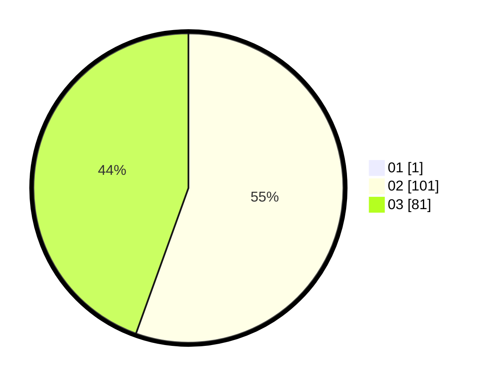

# Hasil

Hasil perolehan suara paslon dapat dilihat pada file paslon-01.txt, paslon-02.txt, dan paslon-03.txt.

Jika tidak ada, artinya data tersebut belum ada pada SIREKAP.

## Perolehan Suara

 * Paslon 01: **1**.
 * Paslon 02: **101**.
 * Paslon 03: **81**.

## Foto C Plano

https://sirekap-obj-formc.kpu.go.id/0f82/pemilu/ppwp/31/72/01/10/02/3172011002037-20240217-160512--adaa70c8-85a4-4d4c-8fa1-84e731fd7bd5.jpg

https://sirekap-obj-formc.kpu.go.id/0f82/pemilu/ppwp/31/72/01/10/02/3172011002037-20240217-160619--3fe6e53d-0c77-4332-b6e4-2c1f334c76ec.jpg

https://sirekap-obj-formc.kpu.go.id/0f82/pemilu/ppwp/31/72/01/10/02/3172011002037-20240217-160724--575675d6-8965-4f67-bc3f-f05a22710c54.jpg

## DATA PEMILIH TETAP

Jumlah pemilih dalam DPT: **186**.
 * L: **74**.
 * P: **112**.

## DATA PENGGUNA HAK PILIH

Jumlah pengguna hak pilih dalam DPT: **163**.
 * L: **68**.
 * P: **95**.

Jumlah pengguna hak pilih dalam DPTb: **16**.
 * L: **4**.
 * P: **12**.

Jumlah pengguna hak pilih dalam DPK: **7**.
 * L: **2**.
 * P: **5**.

Jumlah pengguna hak pilih: **186**.
 * L: **74**.
 * P: **112**.

## JUMLAH SUARA SAH DAN TIDAK SAH

JUMLAH SELURUH SUARA SAH: **183**.

JUMLAH SUARA TIDAK SAH: **3**.

JUMLAH SELURUH SUARA SAH DAN SUARA TIDAK SAH: **186**.
