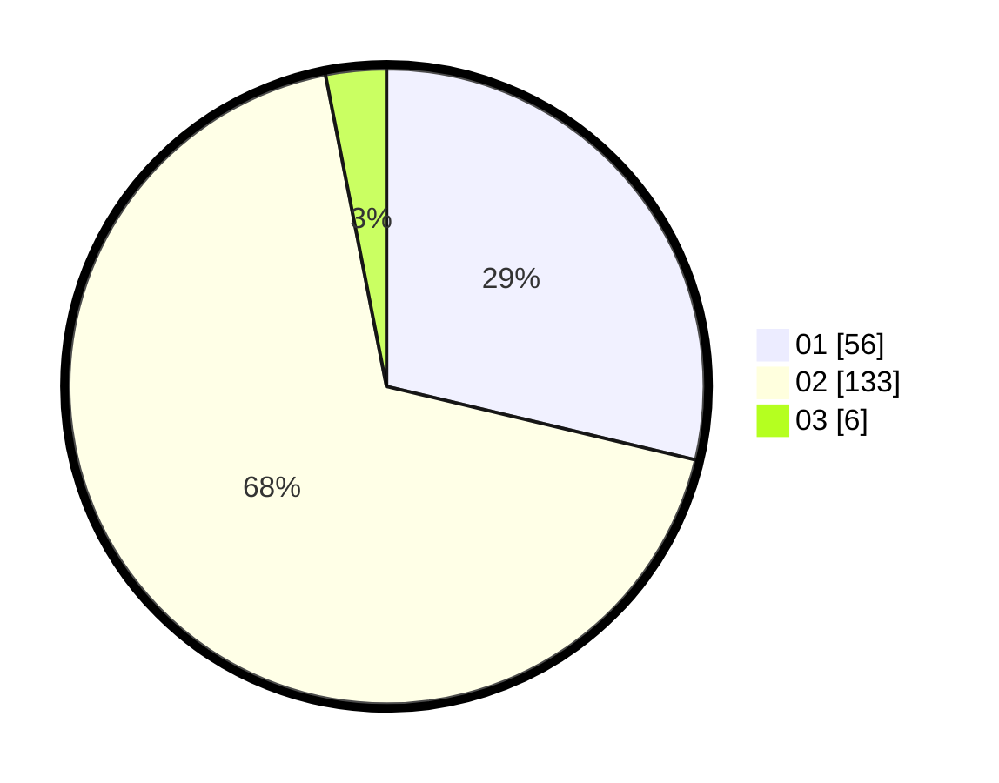

# Hasil

Hasil perolehan suara paslon dapat dilihat pada file paslon-01.txt, paslon-02.txt, dan paslon-03.txt.

Jika tidak ada, artinya data tersebut belum ada pada SIREKAP.

## Perolehan Suara

 * Paslon 01: **56**.
 * Paslon 02: **133**.
 * Paslon 03: **6**.

## Foto C Plano

https://sirekap-obj-formc.kpu.go.id/8a68/pemilu/ppwp/31/72/01/10/03/3172011003001-20240216-140246--d8b3ac3c-8211-4eec-a0cf-ab716eba2782.jpg

https://sirekap-obj-formc.kpu.go.id/8a68/pemilu/ppwp/31/72/01/10/03/3172011003001-20240216-140405--904bf2c1-da21-4fed-b445-eebd8ace187b.jpg

https://sirekap-obj-formc.kpu.go.id/8a68/pemilu/ppwp/31/72/01/10/03/3172011003001-20240216-143204--21e21e7f-e752-4eac-b076-36f10788026f.jpg

## DATA PEMILIH TETAP

Jumlah pemilih dalam DPT: **291**.
 * L: **156**.
 * P: **135**.

## DATA PENGGUNA HAK PILIH

Jumlah pengguna hak pilih dalam DPT: **195**.
 * L: **101**.
 * P: **94**.

Jumlah pengguna hak pilih dalam DPTb: **4**.
 * L: **3**.
 * P: **1**.

Jumlah pengguna hak pilih dalam DPK: **0**.
 * L: **0**.
 * P: **0**.

Jumlah pengguna hak pilih: **199**.
 * L: **104**.
 * P: **95**.

## JUMLAH SUARA SAH DAN TIDAK SAH

JUMLAH SELURUH SUARA SAH: **195**.

JUMLAH SUARA TIDAK SAH: **5**.

JUMLAH SELURUH SUARA SAH DAN SUARA TIDAK SAH: **200**.
