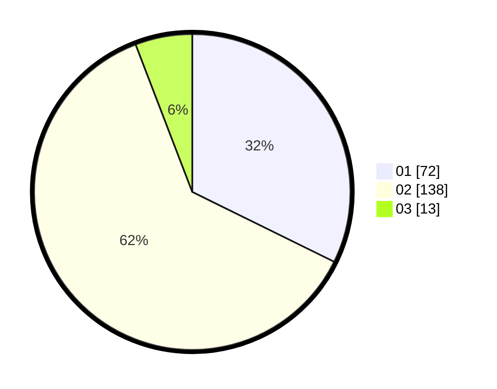

# Hasil

Hasil perolehan suara paslon dapat dilihat pada file paslon-01.txt, paslon-02.txt, dan paslon-03.txt.

Jika tidak ada, artinya data tersebut belum ada pada SIREKAP.

## Perolehan Suara

 * Paslon 01: **72**.
 * Paslon 02: **138**.
 * Paslon 03: **13**.

## Foto C Plano

https://sirekap-obj-formc.kpu.go.id/4351/pemilu/ppwp/31/72/01/10/03/3172011003007-20240216-151432--50ec7cf8-5e14-47c7-b511-220bea19f111.jpg

https://sirekap-obj-formc.kpu.go.id/4351/pemilu/ppwp/31/72/01/10/03/3172011003007-20240216-151653--81f2e4bb-4554-4d69-814a-87d3424b8759.jpg

https://sirekap-obj-formc.kpu.go.id/4351/pemilu/ppwp/31/72/01/10/03/3172011003007-20240216-151715--17bcbdc7-8db3-4d30-86a6-415b038e28cd.jpg

## DATA PEMILIH TETAP

Jumlah pemilih dalam DPT: **291**.
 * L: **146**.
 * P: **145**.

## DATA PENGGUNA HAK PILIH

Jumlah pengguna hak pilih dalam DPT: **219**.
 * L: **105**.
 * P: **114**.

Jumlah pengguna hak pilih dalam DPTb: **4**.
 * L: **0**.
 * P: **4**.

Jumlah pengguna hak pilih dalam DPK: **1**.
 * L: **0**.
 * P: **1**.

Jumlah pengguna hak pilih: **224**.
 * L: **105**.
 * P: **119**.

## JUMLAH SUARA SAH DAN TIDAK SAH

JUMLAH SELURUH SUARA SAH: **216**.

JUMLAH SUARA TIDAK SAH: **7**.

JUMLAH SELURUH SUARA SAH DAN SUARA TIDAK SAH: **223**.
