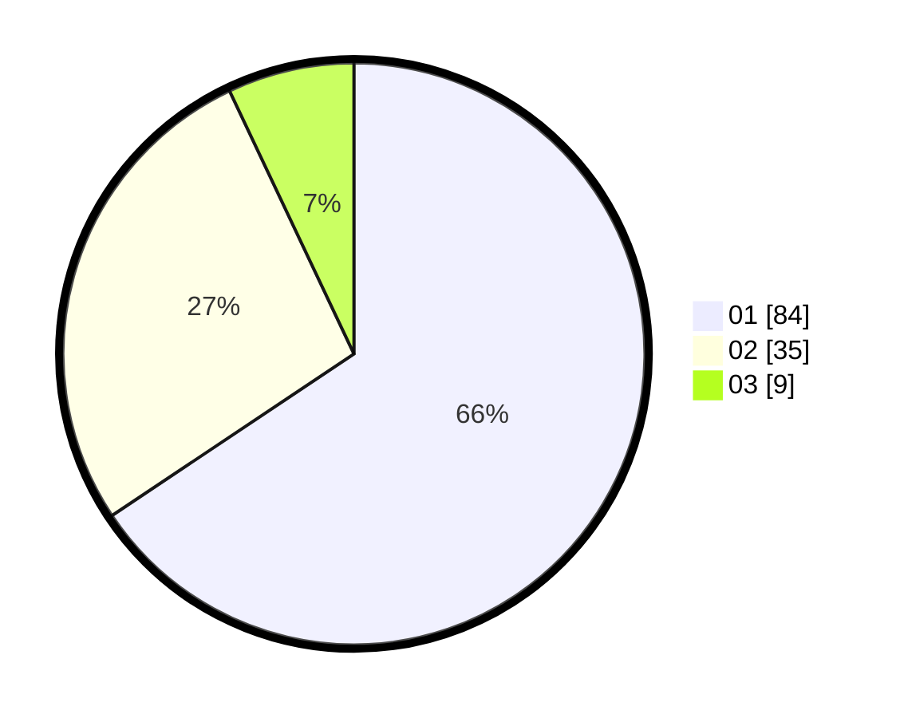

# Hasil

Hasil perolehan suara paslon dapat dilihat pada file paslon-01.txt, paslon-02.txt, dan paslon-03.txt.

Jika tidak ada, artinya data tersebut belum ada pada SIREKAP.

## Perolehan Suara

 * Paslon 01: **84**.
 * Paslon 02: **35**.
 * Paslon 03: **9**.

## Foto C Plano

https://sirekap-obj-formc.kpu.go.id/1753/pemilu/ppwp/31/72/01/10/03/3172011003008-20240216-162256--26066539-7416-4f74-8bfb-5030476e3987.jpg

https://sirekap-obj-formc.kpu.go.id/1753/pemilu/ppwp/31/72/01/10/03/3172011003008-20240216-162025--9a3f7495-d932-4848-8633-b770f51b714b.jpg
