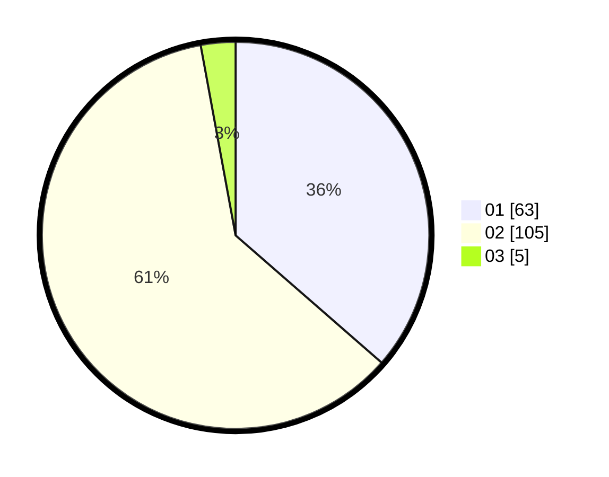

# Hasil

Hasil perolehan suara paslon dapat dilihat pada file paslon-01.txt, paslon-02.txt, dan paslon-03.txt.

Jika tidak ada, artinya data tersebut belum ada pada SIREKAP.

## Perolehan Suara

 * Paslon 01: **63**.
 * Paslon 02: **105**.
 * Paslon 03: **5**.

## Foto C Plano

https://sirekap-obj-formc.kpu.go.id/6804/pemilu/ppwp/31/72/01/10/03/3172011003010-20240216-163707--e6ce82c8-b0e3-476b-a2e9-f6a531ebf3f9.jpg

https://sirekap-obj-formc.kpu.go.id/6804/pemilu/ppwp/31/72/01/10/03/3172011003010-20240216-163947--46573a34-d8c1-4c47-acfe-184995e05443.jpg

https://sirekap-obj-formc.kpu.go.id/6804/pemilu/ppwp/31/72/01/10/03/3172011003010-20240216-164111--0fd37659-e7d8-4e61-813f-61b3a3380ef6.jpg

## DATA PEMILIH TETAP

Jumlah pemilih dalam DPT: **284**.
 * L: **141**.
 * P: **143**.

## DATA PENGGUNA HAK PILIH

Jumlah pengguna hak pilih dalam DPT: **170**.
 * L: **80**.
 * P: **90**.

Jumlah pengguna hak pilih dalam DPTb: **0**.
 * L: **0**.
 * P: **0**.

Jumlah pengguna hak pilih dalam DPK: **4**.
 * L: **2**.
 * P: **2**.

Jumlah pengguna hak pilih: **175**.
 * L: **82**.
 * P: **93**.

## JUMLAH SUARA SAH DAN TIDAK SAH

JUMLAH SELURUH SUARA SAH: **173**.

JUMLAH SUARA TIDAK SAH: **3**.

JUMLAH SELURUH SUARA SAH DAN SUARA TIDAK SAH: **176**.
