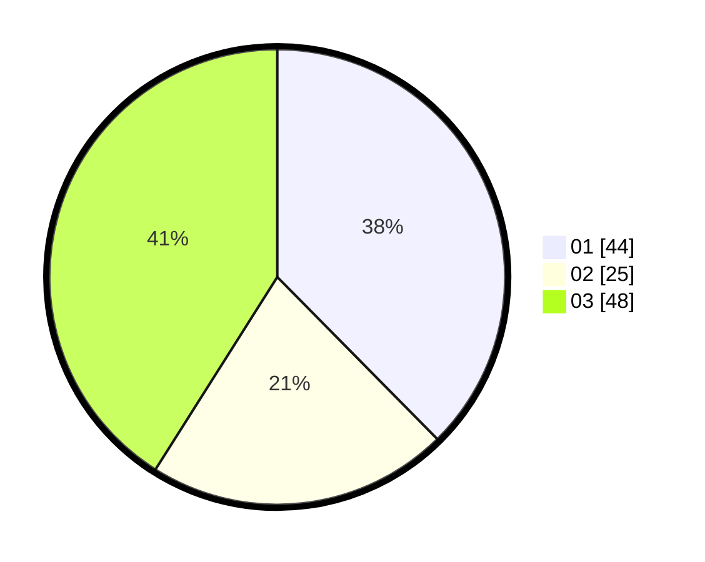

# Hasil

Hasil perolehan suara paslon dapat dilihat pada file paslon-01.txt, paslon-02.txt, dan paslon-03.txt.

Jika tidak ada, artinya data tersebut belum ada pada SIREKAP.

## Perolehan Suara

 * Paslon 01: **44**.
 * Paslon 02: **25**.
 * Paslon 03: **48**.

## Foto C Plano

https://sirekap-obj-formc.kpu.go.id/604e/pemilu/ppwp/31/72/01/10/03/3172011003017-20240216-170840--e1d28734-d0ce-4bb7-9c57-ea60b30fcb48.jpg

https://sirekap-obj-formc.kpu.go.id/604e/pemilu/ppwp/31/72/01/10/03/3172011003017-20240216-170858--ff6c847c-3c1c-4fb7-8962-4dc982154499.jpg

https://sirekap-obj-formc.kpu.go.id/604e/pemilu/ppwp/31/72/01/10/03/3172011003017-20240216-170925--67eba452-77ea-4064-85c4-01103a4d06f3.jpg

## DATA PEMILIH TETAP

Jumlah pemilih dalam DPT: **291**.
 * L: **151**.
 * P: **140**.

## DATA PENGGUNA HAK PILIH

Jumlah pengguna hak pilih dalam DPT: **209**.
 * L: **101**.
 * P: **108**.

Jumlah pengguna hak pilih dalam DPTb: **15**.
 * L: **11**.
 * P: **4**.

Jumlah pengguna hak pilih dalam DPK: **4**.
 * L: **2**.
 * P: **2**.

Jumlah pengguna hak pilih: **228**.
 * L: **114**.
 * P: **114**.

## JUMLAH SUARA SAH DAN TIDAK SAH

JUMLAH SELURUH SUARA SAH: **224**.

JUMLAH SUARA TIDAK SAH: **4**.

JUMLAH SELURUH SUARA SAH DAN SUARA TIDAK SAH: **228**.
