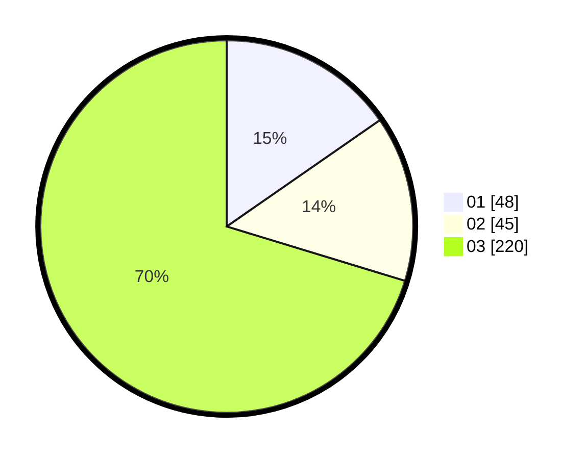

# Hasil

Hasil perolehan suara paslon dapat dilihat pada file paslon-01.txt, paslon-02.txt, dan paslon-03.txt.

Jika tidak ada, artinya data tersebut belum ada pada SIREKAP.

## Perolehan Suara

 * Paslon 01: **48**.
 * Paslon 02: **45**.
 * Paslon 03: **220**.

## Foto C Plano

https://sirekap-obj-formc.kpu.go.id/ff57/pemilu/ppwp/31/72/01/10/03/3172011003021-20240216-175942--5f92b03f-b292-4516-9dac-78c4934709f0.jpg

https://sirekap-obj-formc.kpu.go.id/ff57/pemilu/ppwp/31/72/01/10/03/3172011003021-20240216-180122--e9e534b6-5815-47f8-9669-d0175de34c59.jpg

https://sirekap-obj-formc.kpu.go.id/ff57/pemilu/ppwp/31/72/01/10/03/3172011003021-20240216-180005--82aa679a-76e9-4ae5-abcc-eb7505625414.jpg

## DATA PEMILIH TETAP

Jumlah pemilih dalam DPT: **295**.
 * L: **141**.
 * P: **154**.

## DATA PENGGUNA HAK PILIH

Jumlah pengguna hak pilih dalam DPT: **175**.
 * L: **78**.
 * P: **97**.

Jumlah pengguna hak pilih dalam DPTb: **13**.
 * L: **2**.
 * P: **11**.

Jumlah pengguna hak pilih dalam DPK: **13**.
 * L: **5**.
 * P: **8**.

Jumlah pengguna hak pilih: **201**.
 * L: **85**.
 * P: **116**.

## JUMLAH SUARA SAH DAN TIDAK SAH

JUMLAH SELURUH SUARA SAH: **201**.

JUMLAH SUARA TIDAK SAH: **0**.

JUMLAH SELURUH SUARA SAH DAN SUARA TIDAK SAH: **201**.
