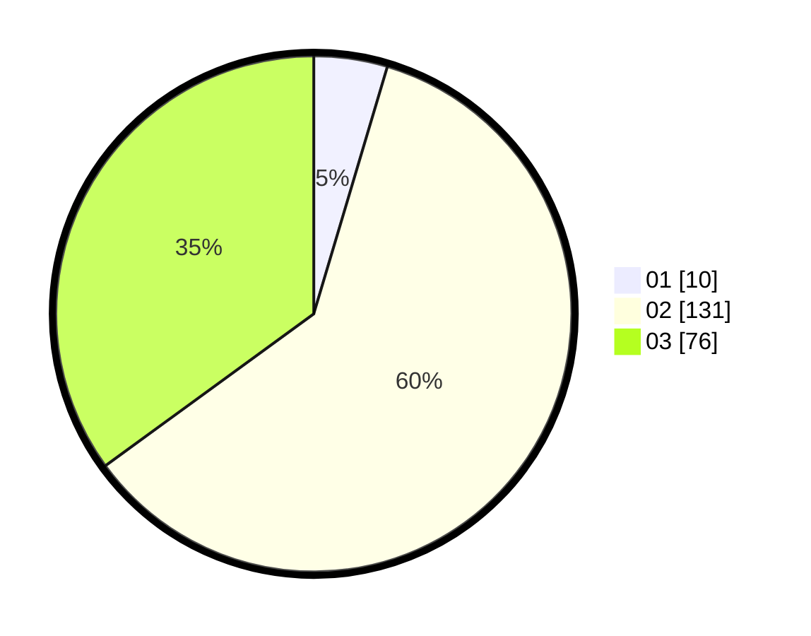

# Hasil

Hasil perolehan suara paslon dapat dilihat pada file paslon-01.txt, paslon-02.txt, dan paslon-03.txt.

Jika tidak ada, artinya data tersebut belum ada pada SIREKAP.

## Perolehan Suara

 * Paslon 01: **10**.
 * Paslon 02: **131**.
 * Paslon 03: **76**.

## Foto C Plano

https://sirekap-obj-formc.kpu.go.id/854f/pemilu/ppwp/31/72/01/10/03/3172011003025-20240216-181309--3c09f429-71a9-4184-9785-bbc76ee50972.jpg

https://sirekap-obj-formc.kpu.go.id/854f/pemilu/ppwp/31/72/01/10/03/3172011003025-20240216-181218--e4ee31eb-d6b6-4448-90dc-d4814ce57478.jpg

https://sirekap-obj-formc.kpu.go.id/854f/pemilu/ppwp/31/72/01/10/03/3172011003025-20240216-181346--5e0171c5-2312-4229-88d2-76065033cea7.jpg

## DATA PEMILIH TETAP

Jumlah pemilih dalam DPT: **207**.
 * L: **112**.
 * P: **95**.

## DATA PENGGUNA HAK PILIH

Jumlah pengguna hak pilih dalam DPT: **208**.
 * L: **112**.
 * P: **96**.

Jumlah pengguna hak pilih dalam DPTb: **13**.
 * L: **7**.
 * P: **6**.

Jumlah pengguna hak pilih dalam DPK: **2**.
 * L: **0**.
 * P: **2**.

Jumlah pengguna hak pilih: **223**.
 * L: **119**.
 * P: **104**.

## JUMLAH SUARA SAH DAN TIDAK SAH

JUMLAH SELURUH SUARA SAH: **217**.

JUMLAH SUARA TIDAK SAH: **6**.

JUMLAH SELURUH SUARA SAH DAN SUARA TIDAK SAH: **223**.
