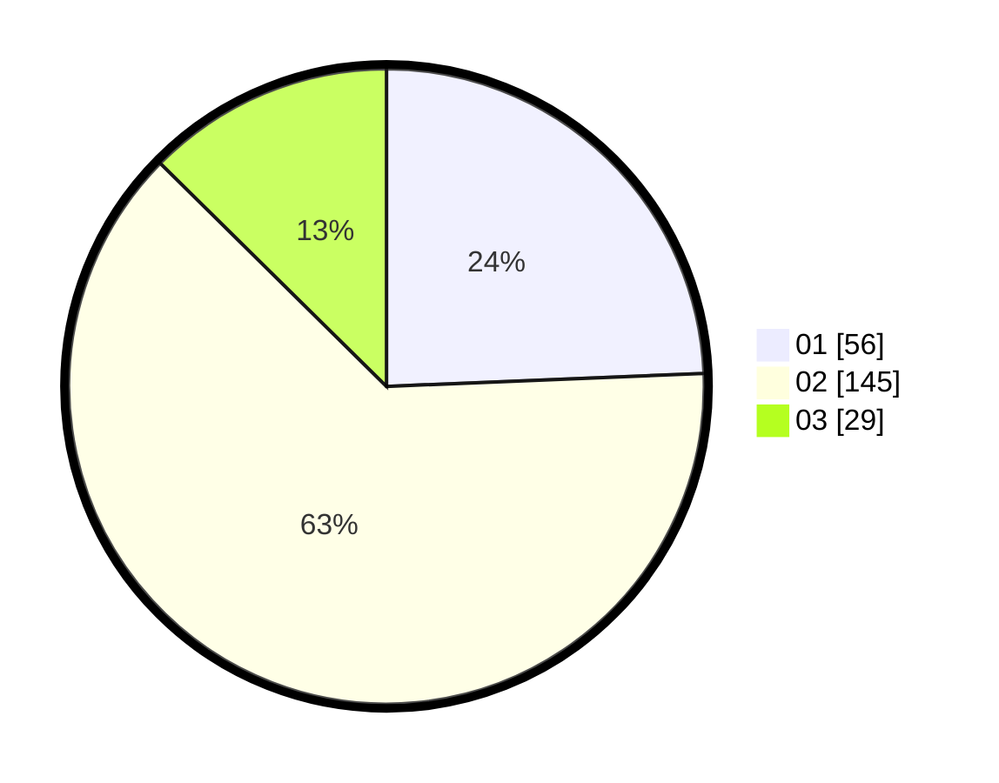

# Hasil

Hasil perolehan suara paslon dapat dilihat pada file paslon-01.txt, paslon-02.txt, dan paslon-03.txt.

Jika tidak ada, artinya data tersebut belum ada pada SIREKAP.

## Perolehan Suara

 * Paslon 01: **56**.
 * Paslon 02: **145**.
 * Paslon 03: **29**.

## Foto C Plano

https://sirekap-obj-formc.kpu.go.id/86cc/pemilu/ppwp/31/72/01/10/03/3172011003027-20240216-193211--e4fc3f53-fa5a-40a7-b1b2-ffc1f9635fde.jpg

https://sirekap-obj-formc.kpu.go.id/86cc/pemilu/ppwp/31/72/01/10/03/3172011003027-20240216-193230--35676583-a32d-43a1-9f69-96abe1217e29.jpg

https://sirekap-obj-formc.kpu.go.id/86cc/pemilu/ppwp/31/72/01/10/03/3172011003027-20240216-193640--2bdcba1a-7ab9-44fe-b37b-ba7d5652fd43.jpg

## DATA PEMILIH TETAP

Jumlah pemilih dalam DPT: **288**.
 * L: **151**.
 * P: **137**.

## DATA PENGGUNA HAK PILIH

Jumlah pengguna hak pilih dalam DPT: **203**.
 * L: **108**.
 * P: **95**.

Jumlah pengguna hak pilih dalam DPTb: **22**.
 * L: **8**.
 * P: **14**.

Jumlah pengguna hak pilih dalam DPK: **8**.
 * L: **3**.
 * P: **5**.

Jumlah pengguna hak pilih: **233**.
 * L: **119**.
 * P: **114**.

## JUMLAH SUARA SAH DAN TIDAK SAH

JUMLAH SELURUH SUARA SAH: **230**.

JUMLAH SUARA TIDAK SAH: **3**.

JUMLAH SELURUH SUARA SAH DAN SUARA TIDAK SAH: **233**.
