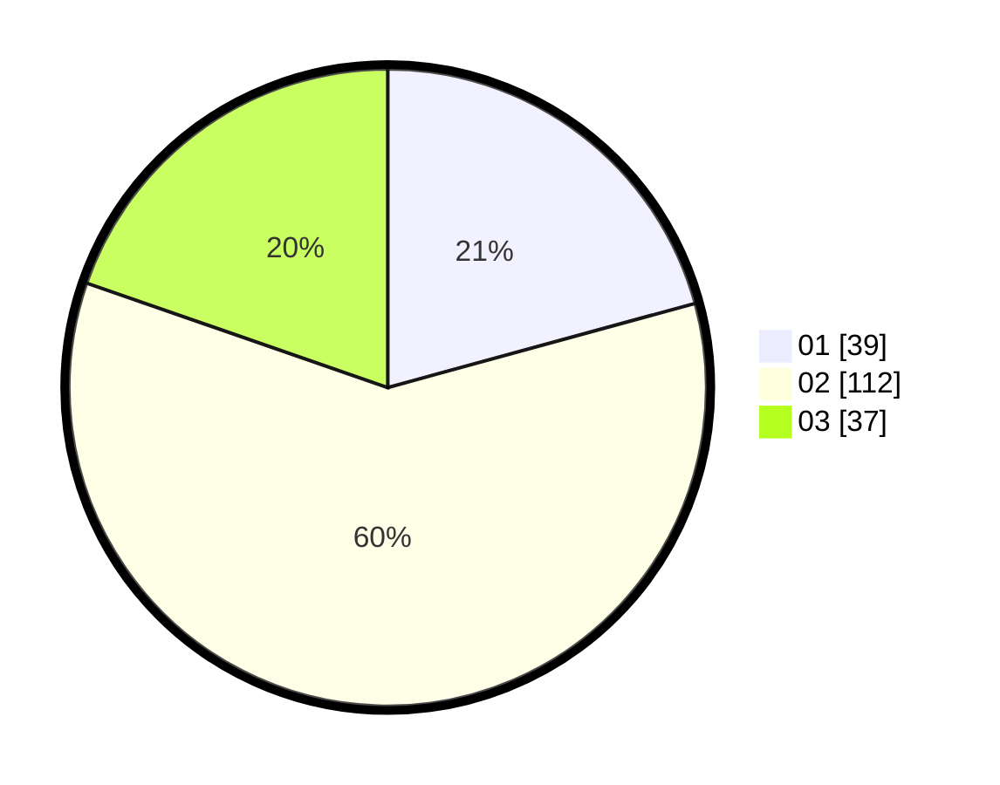

# Hasil

Hasil perolehan suara paslon dapat dilihat pada file paslon-01.txt, paslon-02.txt, dan paslon-03.txt.

Jika tidak ada, artinya data tersebut belum ada pada SIREKAP.

## Perolehan Suara

 * Paslon 01: **39**.
 * Paslon 02: **112**.
 * Paslon 03: **37**.

## Foto C Plano

https://sirekap-obj-formc.kpu.go.id/c599/pemilu/ppwp/31/72/01/10/03/3172011003029-20240216-194252--0f975f32-1e60-47f4-af5a-9a9c4898c91a.jpg

https://sirekap-obj-formc.kpu.go.id/c599/pemilu/ppwp/31/72/01/10/03/3172011003029-20240216-194324--a401a651-59d6-4903-9f35-f1c0c2685583.jpg

https://sirekap-obj-formc.kpu.go.id/c599/pemilu/ppwp/31/72/01/10/03/3172011003029-20240216-194400--1e0fd267-77b6-4380-82a0-fb58c9d5daf1.jpg

## DATA PEMILIH TETAP

Jumlah pemilih dalam DPT: **284**.
 * L: **141**.
 * P: **143**.

## DATA PENGGUNA HAK PILIH

Jumlah pengguna hak pilih dalam DPT: **185**.
 * L: **92**.
 * P: **93**.

Jumlah pengguna hak pilih dalam DPTb: **8**.
 * L: **6**.
 * P: **2**.

Jumlah pengguna hak pilih dalam DPK: **2**.
 * L: **0**.
 * P: **2**.

Jumlah pengguna hak pilih: **195**.
 * L: **98**.
 * P: **97**.

## JUMLAH SUARA SAH DAN TIDAK SAH

JUMLAH SELURUH SUARA SAH: **188**.

JUMLAH SUARA TIDAK SAH: **7**.

JUMLAH SELURUH SUARA SAH DAN SUARA TIDAK SAH: **195**.
