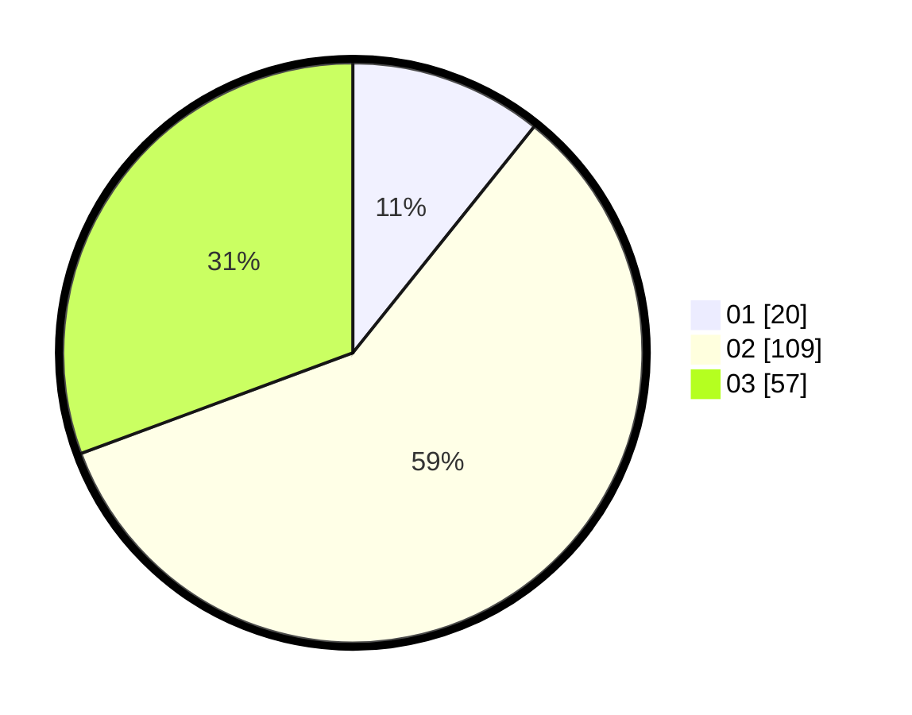

# Hasil

Hasil perolehan suara paslon dapat dilihat pada file paslon-01.txt, paslon-02.txt, dan paslon-03.txt.

Jika tidak ada, artinya data tersebut belum ada pada SIREKAP.

## Perolehan Suara

 * Paslon 01: **20**.
 * Paslon 02: **109**.
 * Paslon 03: **57**.

## Foto C Plano

https://sirekap-obj-formc.kpu.go.id/e597/pemilu/ppwp/31/72/01/10/03/3172011003033-20240216-195400--ffec9d8c-4a59-4e43-a62e-cb8c7e2c441e.jpg

https://sirekap-obj-formc.kpu.go.id/e597/pemilu/ppwp/31/72/01/10/03/3172011003033-20240216-195503--3a5a7cf5-793d-4920-ae91-afcc29fcadc0.jpg

https://sirekap-obj-formc.kpu.go.id/e597/pemilu/ppwp/31/72/01/10/03/3172011003033-20240216-195522--d15d2343-606a-46ba-864b-0e1025461691.jpg

## DATA PEMILIH TETAP

Jumlah pemilih dalam DPT: **256**.
 * L: **119**.
 * P: **137**.

## DATA PENGGUNA HAK PILIH

Jumlah pengguna hak pilih dalam DPT: **169**.
 * L: **79**.
 * P: **90**.

Jumlah pengguna hak pilih dalam DPTb: **18**.
 * L: **12**.
 * P: **6**.

Jumlah pengguna hak pilih dalam DPK: **0**.
 * L: **0**.
 * P: **0**.

Jumlah pengguna hak pilih: **187**.
 * L: **91**.
 * P: **96**.

## JUMLAH SUARA SAH DAN TIDAK SAH

JUMLAH SELURUH SUARA SAH: **186**.

JUMLAH SUARA TIDAK SAH: **1**.

JUMLAH SELURUH SUARA SAH DAN SUARA TIDAK SAH: **187**.
