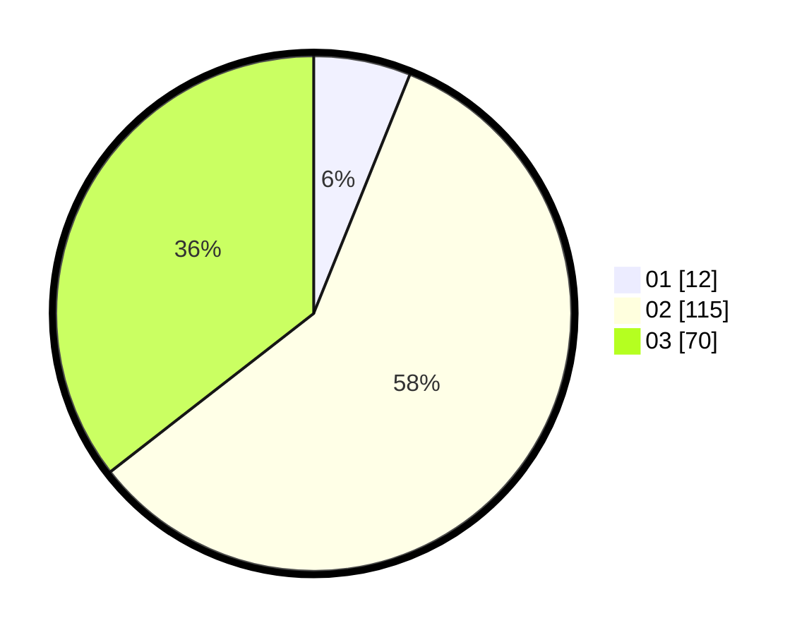

# Hasil

Hasil perolehan suara paslon dapat dilihat pada file paslon-01.txt, paslon-02.txt, dan paslon-03.txt.

Jika tidak ada, artinya data tersebut belum ada pada SIREKAP.

## Perolehan Suara

 * Paslon 01: **12**.
 * Paslon 02: **115**.
 * Paslon 03: **70**.

## Foto C Plano

https://sirekap-obj-formc.kpu.go.id/24c1/pemilu/ppwp/31/72/01/10/03/3172011003035-20240216-200150--991844e1-95e8-4f6c-91c4-b9188c3525e0.jpg

https://sirekap-obj-formc.kpu.go.id/24c1/pemilu/ppwp/31/72/01/10/03/3172011003035-20240216-200638--1b490ef2-189f-45d2-9d6e-28deef3f4613.jpg

https://sirekap-obj-formc.kpu.go.id/24c1/pemilu/ppwp/31/72/01/10/03/3172011003035-20240216-200714--7b86f6da-7e05-43d6-8271-46fc8dfd2615.jpg

## DATA PEMILIH TETAP

Jumlah pemilih dalam DPT: **285**.
 * L: **144**.
 * P: **141**.

## DATA PENGGUNA HAK PILIH

Jumlah pengguna hak pilih dalam DPT: **180**.
 * L: **83**.
 * P: **97**.

Jumlah pengguna hak pilih dalam DPTb: **12**.
 * L: **7**.
 * P: **5**.

Jumlah pengguna hak pilih dalam DPK: **8**.
 * L: **6**.
 * P: **2**.

Jumlah pengguna hak pilih: **200**.
 * L: **96**.
 * P: **104**.

## JUMLAH SUARA SAH DAN TIDAK SAH

JUMLAH SELURUH SUARA SAH: **197**.

JUMLAH SUARA TIDAK SAH: **3**.

JUMLAH SELURUH SUARA SAH DAN SUARA TIDAK SAH: **200**.
