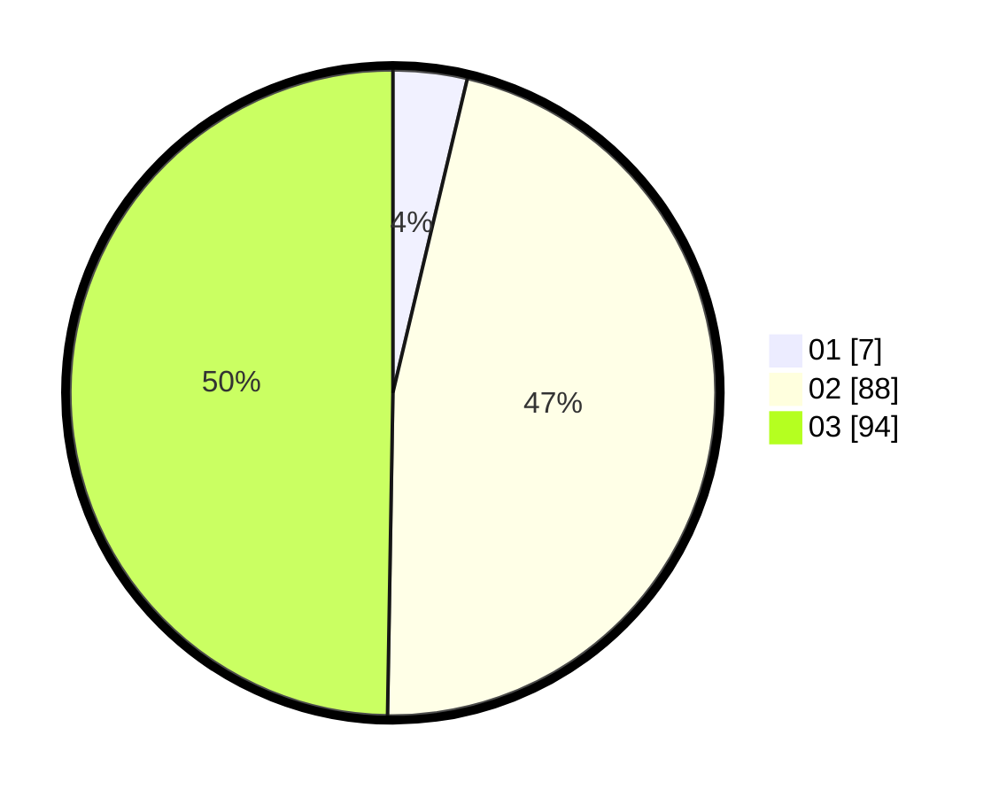

# Hasil

Hasil perolehan suara paslon dapat dilihat pada file paslon-01.txt, paslon-02.txt, dan paslon-03.txt.

Jika tidak ada, artinya data tersebut belum ada pada SIREKAP.

## Perolehan Suara

 * Paslon 01: **7**.
 * Paslon 02: **88**.
 * Paslon 03: **94**.

## Foto C Plano

https://sirekap-obj-formc.kpu.go.id/6496/pemilu/ppwp/31/72/01/10/03/3172011003036-20240216-205223--63e61cf1-f517-4d1f-8f18-67b765630803.jpg

https://sirekap-obj-formc.kpu.go.id/6496/pemilu/ppwp/31/72/01/10/03/3172011003036-20240216-205240--d47f53c4-4c1d-4b66-a2fe-ec62f8e81be2.jpg

https://sirekap-obj-formc.kpu.go.id/6496/pemilu/ppwp/31/72/01/10/03/3172011003036-20240216-205256--0b30f0d6-170d-4535-abbf-538fbb361b1e.jpg

## DATA PEMILIH TETAP

Jumlah pemilih dalam DPT: **284**.
 * L: **149**.
 * P: **135**.

## DATA PENGGUNA HAK PILIH

Jumlah pengguna hak pilih dalam DPT: **180**.
 * L: **99**.
 * P: **81**.

Jumlah pengguna hak pilih dalam DPTb: **10**.
 * L: **7**.
 * P: **3**.

Jumlah pengguna hak pilih dalam DPK: **1**.
 * L: **1**.
 * P: **0**.

Jumlah pengguna hak pilih: **191**.
 * L: **107**.
 * P: **84**.

## JUMLAH SUARA SAH DAN TIDAK SAH

JUMLAH SELURUH SUARA SAH: **189**.

JUMLAH SUARA TIDAK SAH: **2**.

JUMLAH SELURUH SUARA SAH DAN SUARA TIDAK SAH: **191**.
