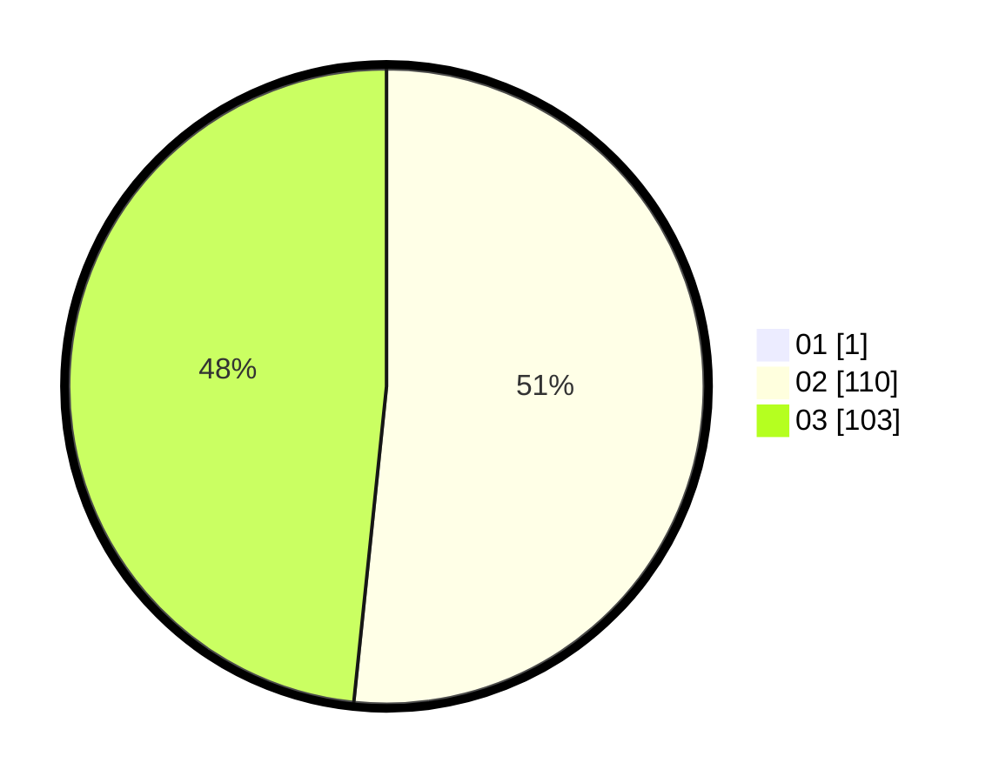

# Hasil

Hasil perolehan suara paslon dapat dilihat pada file paslon-01.txt, paslon-02.txt, dan paslon-03.txt.

Jika tidak ada, artinya data tersebut belum ada pada SIREKAP.

## Perolehan Suara

 * Paslon 01: **1**.
 * Paslon 02: **110**.
 * Paslon 03: **103**.

## Foto C Plano

https://sirekap-obj-formc.kpu.go.id/cc69/pemilu/ppwp/31/72/01/10/03/3172011003037-20240216-205344--8e09a3e8-f412-442c-b896-a9947262e558.jpg

https://sirekap-obj-formc.kpu.go.id/cc69/pemilu/ppwp/31/72/01/10/03/3172011003037-20240216-205413--422be79c-57f4-4e3f-a354-1aae77ad365e.jpg

https://sirekap-obj-formc.kpu.go.id/cc69/pemilu/ppwp/31/72/01/10/03/3172011003037-20240216-205447--49881c9a-c8dc-40a1-a320-2c43bc216e4e.jpg

## DATA PEMILIH TETAP

Jumlah pemilih dalam DPT: **283**.
 * L: **151**.
 * P: **132**.

## DATA PENGGUNA HAK PILIH

Jumlah pengguna hak pilih dalam DPT: **210**.
 * L: **117**.
 * P: **93**.

Jumlah pengguna hak pilih dalam DPTb: **1**.
 * L: **1**.
 * P: **0**.

Jumlah pengguna hak pilih dalam DPK: **3**.
 * L: **0**.
 * P: **3**.

Jumlah pengguna hak pilih: **214**.
 * L: **118**.
 * P: **96**.

## JUMLAH SUARA SAH DAN TIDAK SAH

JUMLAH SELURUH SUARA SAH: **214**.

JUMLAH SUARA TIDAK SAH: **0**.

JUMLAH SELURUH SUARA SAH DAN SUARA TIDAK SAH: **214**.
