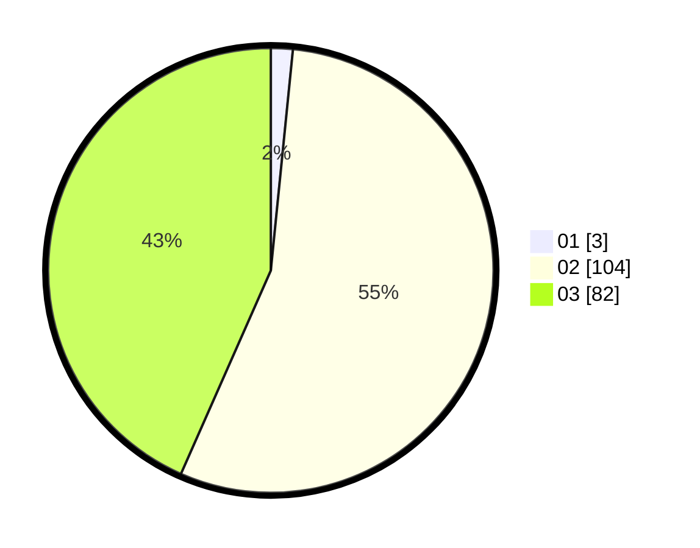

# Hasil

Hasil perolehan suara paslon dapat dilihat pada file paslon-01.txt, paslon-02.txt, dan paslon-03.txt.

Jika tidak ada, artinya data tersebut belum ada pada SIREKAP.

## Perolehan Suara

 * Paslon 01: **3**.
 * Paslon 02: **104**.
 * Paslon 03: **82**.

## Foto C Plano

https://sirekap-obj-formc.kpu.go.id/c535/pemilu/ppwp/31/72/01/10/03/3172011003038-20240214-191827--bb27728e-e380-4571-bed1-50fc0ba7f492.jpg

https://sirekap-obj-formc.kpu.go.id/c535/pemilu/ppwp/31/72/01/10/03/3172011003038-20240214-231710--249345cf-3cf5-4a03-9b83-5f88fbdd813e.jpg

https://sirekap-obj-formc.kpu.go.id/c535/pemilu/ppwp/31/72/01/10/03/3172011003038-20240214-192058--c66ca185-e29c-44a7-a74e-8d9859cd77af.jpg

## DATA PEMILIH TETAP

Jumlah pemilih dalam DPT: **286**.
 * L: **146**.
 * P: **140**.

## DATA PENGGUNA HAK PILIH

Jumlah pengguna hak pilih dalam DPT: **286**.
 * L: **146**.
 * P: **140**.

Jumlah pengguna hak pilih dalam DPTb: **0**.
 * L: **0**.
 * P: **0**.

Jumlah pengguna hak pilih dalam DPK: **1**.
 * L: **0**.
 * P: **1**.

Jumlah pengguna hak pilih: **287**.
 * L: **146**.
 * P: **141**.

## JUMLAH SUARA SAH DAN TIDAK SAH

JUMLAH SELURUH SUARA SAH: **189**.

JUMLAH SUARA TIDAK SAH: **1**.

JUMLAH SELURUH SUARA SAH DAN SUARA TIDAK SAH: **190**.
