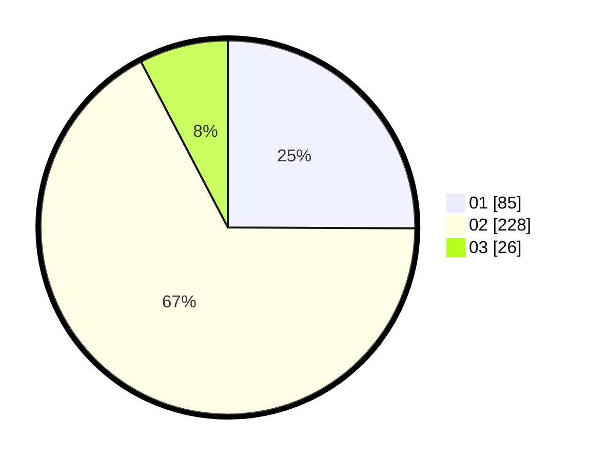

# Hasil

Hasil perolehan suara paslon dapat dilihat pada file paslon-01.txt, paslon-02.txt, dan paslon-03.txt.

Jika tidak ada, artinya data tersebut belum ada pada SIREKAP.

## Perolehan Suara

 * Paslon 01: **85**.
 * Paslon 02: **228**.
 * Paslon 03: **26**.

## Foto C Plano

https://sirekap-obj-formc.kpu.go.id/c815/pemilu/ppwp/31/72/01/10/03/3172011003040-20240216-205928--ca69bb15-d417-4242-b3b9-389aa74a3a7b.jpg

https://sirekap-obj-formc.kpu.go.id/c815/pemilu/ppwp/31/72/01/10/03/3172011003040-20240216-210009--58eb2b33-4e84-4c62-b42f-fe136d16c255.jpg

https://sirekap-obj-formc.kpu.go.id/c815/pemilu/ppwp/31/72/01/10/03/3172011003040-20240216-210034--afa08e05-a05f-41bd-ab57-99d604d93c7f.jpg

## DATA PEMILIH TETAP

Jumlah pemilih dalam DPT: **286**.
 * L: **137**.
 * P: **149**.

## DATA PENGGUNA HAK PILIH

Jumlah pengguna hak pilih dalam DPT: **219**.
 * L: **105**.
 * P: **114**.

Jumlah pengguna hak pilih dalam DPTb: **17**.
 * L: **9**.
 * P: **8**.

Jumlah pengguna hak pilih dalam DPK: **3**.
 * L: **3**.
 * P: **0**.

Jumlah pengguna hak pilih: **239**.
 * L: **117**.
 * P: **122**.

## JUMLAH SUARA SAH DAN TIDAK SAH

JUMLAH SELURUH SUARA SAH: **239**.

JUMLAH SUARA TIDAK SAH: **0**.

JUMLAH SELURUH SUARA SAH DAN SUARA TIDAK SAH: **239**.
