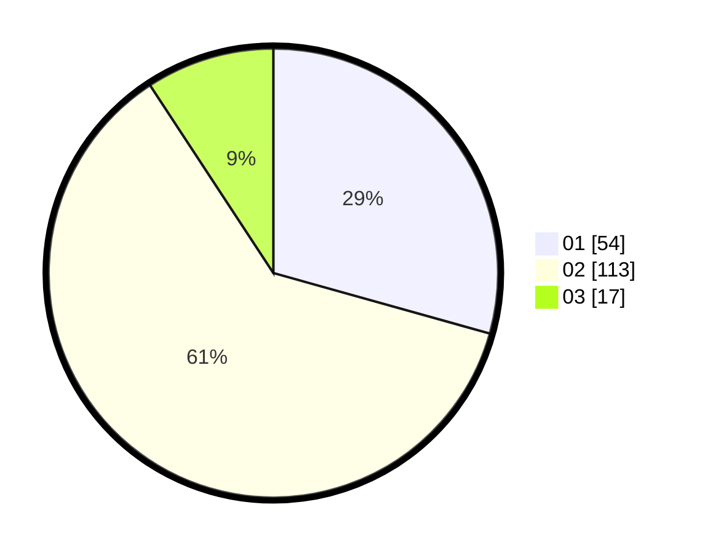

# Hasil

Hasil perolehan suara paslon dapat dilihat pada file paslon-01.txt, paslon-02.txt, dan paslon-03.txt.

Jika tidak ada, artinya data tersebut belum ada pada SIREKAP.

## Perolehan Suara

 * Paslon 01: **54**.
 * Paslon 02: **113**.
 * Paslon 03: **17**.

## Foto C Plano

https://sirekap-obj-formc.kpu.go.id/10da/pemilu/ppwp/31/72/01/10/03/3172011003061-20240216-235413--0115ce42-513d-4ce1-b4ae-16492a6cd54f.jpg

https://sirekap-obj-formc.kpu.go.id/10da/pemilu/ppwp/31/72/01/10/03/3172011003061-20240216-235635--2d9cf9df-71c1-4714-af38-4bb80e8c88a0.jpg

https://sirekap-obj-formc.kpu.go.id/10da/pemilu/ppwp/31/72/01/10/03/3172011003061-20240216-202313--32cb3c48-1f91-490f-afa0-eb4e6abb863d.jpg
