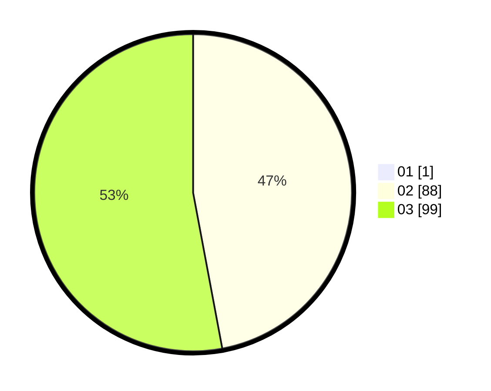

# Hasil

Hasil perolehan suara paslon dapat dilihat pada file paslon-01.txt, paslon-02.txt, dan paslon-03.txt.

Jika tidak ada, artinya data tersebut belum ada pada SIREKAP.

## Perolehan Suara

 * Paslon 01: **1**.
 * Paslon 02: **88**.
 * Paslon 03: **99**.

## Foto C Plano

https://sirekap-obj-formc.kpu.go.id/1311/pemilu/ppwp/31/72/01/10/03/3172011003075-20240214-191249--635adf4e-5927-4a96-868b-7c3d1512379d.jpg

https://sirekap-obj-formc.kpu.go.id/1311/pemilu/ppwp/31/72/01/10/03/3172011003075-20240214-191420--e2ad222d-1a95-425a-9c4e-14c5f9b03d08.jpg

https://sirekap-obj-formc.kpu.go.id/1311/pemilu/ppwp/31/72/01/10/03/3172011003075-20240214-195329--ea8dd2ad-8f3d-4b66-817d-f94e117d6e97.jpg
