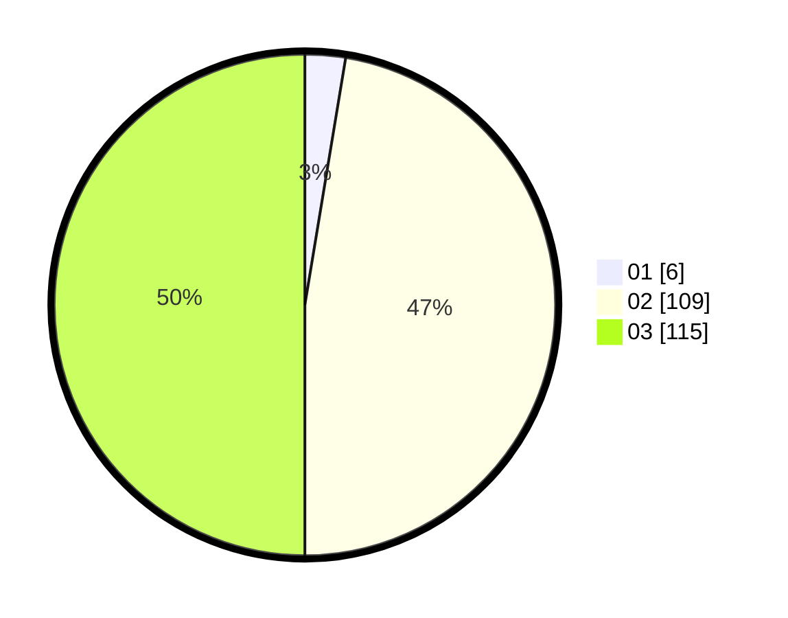

# Hasil

Hasil perolehan suara paslon dapat dilihat pada file paslon-01.txt, paslon-02.txt, dan paslon-03.txt.

Jika tidak ada, artinya data tersebut belum ada pada SIREKAP.

## Perolehan Suara

 * Paslon 01: **6**.
 * Paslon 02: **109**.
 * Paslon 03: **115**.

## Foto C Plano

https://sirekap-obj-formc.kpu.go.id/4431/pemilu/ppwp/31/72/01/10/03/3172011003095-20240214-190126--fa9ef729-2a29-413a-94ea-cede7d2e7872.jpg

https://sirekap-obj-formc.kpu.go.id/4431/pemilu/ppwp/31/72/01/10/03/3172011003095-20240214-190134--5286a599-b93e-44c4-8733-3900d7481b17.jpg

https://sirekap-obj-formc.kpu.go.id/4431/pemilu/ppwp/31/72/01/10/03/3172011003095-20240214-190144--16387567-d66a-44df-aaaa-8085ae9fd777.jpg

## DATA PEMILIH TETAP

Jumlah pemilih dalam DPT: **288**.
 * L: **142**.
 * P: **146**.

## DATA PENGGUNA HAK PILIH

Jumlah pengguna hak pilih dalam DPT: **202**.
 * L: **101**.
 * P: **101**.

Jumlah pengguna hak pilih dalam DPTb: **20**.
 * L: **11**.
 * P: **9**.

Jumlah pengguna hak pilih dalam DPK: **9**.
 * L: **5**.
 * P: **4**.

Jumlah pengguna hak pilih: **231**.
 * L: **117**.
 * P: **114**.

## JUMLAH SUARA SAH DAN TIDAK SAH

JUMLAH SELURUH SUARA SAH: **130**.

JUMLAH SUARA TIDAK SAH: **1**.

JUMLAH SELURUH SUARA SAH DAN SUARA TIDAK SAH: **131**.
