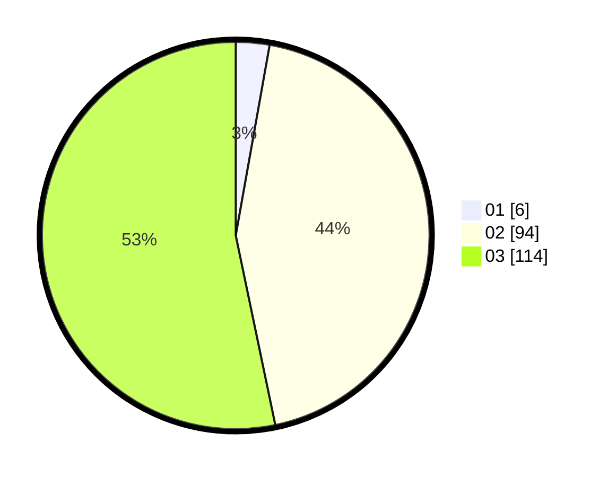

# Hasil

Hasil perolehan suara paslon dapat dilihat pada file paslon-01.txt, paslon-02.txt, dan paslon-03.txt.

Jika tidak ada, artinya data tersebut belum ada pada SIREKAP.

## Perolehan Suara

 * Paslon 01: **6**.
 * Paslon 02: **94**.
 * Paslon 03: **114**.

## Foto C Plano

https://sirekap-obj-formc.kpu.go.id/66d9/pemilu/ppwp/31/72/01/10/03/3172011003105-20240214-185743--d6d5a8c0-36ed-4c7f-846d-d4b0d7977c02.jpg

https://sirekap-obj-formc.kpu.go.id/66d9/pemilu/ppwp/31/72/01/10/03/3172011003105-20240214-185745--98c2e0ef-b0ae-450a-8935-f8441d129e5f.jpg

https://sirekap-obj-formc.kpu.go.id/66d9/pemilu/ppwp/31/72/01/10/03/3172011003105-20240214-185748--b8e5238d-b0bc-44a0-b54b-8403a29dc4c5.jpg

## DATA PEMILIH TETAP

Jumlah pemilih dalam DPT: **278**.
 * L: **135**.
 * P: **143**.

## DATA PENGGUNA HAK PILIH

Jumlah pengguna hak pilih dalam DPT: **198**.
 * L: **99**.
 * P: **99**.

Jumlah pengguna hak pilih dalam DPTb: **17**.
 * L: **8**.
 * P: **9**.

Jumlah pengguna hak pilih dalam DPK: **5**.
 * L: **1**.
 * P: **4**.

Jumlah pengguna hak pilih: **220**.
 * L: **108**.
 * P: **112**.

## JUMLAH SUARA SAH DAN TIDAK SAH

JUMLAH SELURUH SUARA SAH: **214**.

JUMLAH SUARA TIDAK SAH: **6**.

JUMLAH SELURUH SUARA SAH DAN SUARA TIDAK SAH: **220**.
