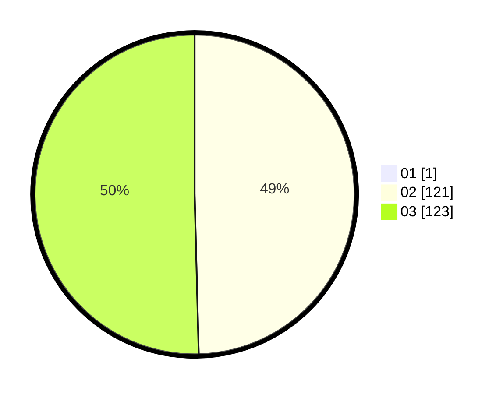

# Hasil

Hasil perolehan suara paslon dapat dilihat pada file paslon-01.txt, paslon-02.txt, dan paslon-03.txt.

Jika tidak ada, artinya data tersebut belum ada pada SIREKAP.

## Perolehan Suara

 * Paslon 01: **1**.
 * Paslon 02: **121**.
 * Paslon 03: **123**.

## Foto C Plano

https://sirekap-obj-formc.kpu.go.id/f342/pemilu/ppwp/31/72/01/10/03/3172011003116-20240214-155057--59e31d88-50fc-4e04-8cfe-f2795df89b93.jpg

https://sirekap-obj-formc.kpu.go.id/f342/pemilu/ppwp/31/72/01/10/03/3172011003116-20240214-155151--0054f3c5-fada-42d6-91c4-5ab779f9f677.jpg

https://sirekap-obj-formc.kpu.go.id/f342/pemilu/ppwp/31/72/01/10/03/3172011003116-20240214-155236--7165948f-4e07-487c-aacf-f48837bf750a.jpg

## DATA PEMILIH TETAP

Jumlah pemilih dalam DPT: **290**.
 * L: **127**.
 * P: **163**.

## DATA PENGGUNA HAK PILIH

Jumlah pengguna hak pilih dalam DPT: **221**.
 * L: **97**.
 * P: **124**.

Jumlah pengguna hak pilih dalam DPTb: **18**.
 * L: **3**.
 * P: **15**.

Jumlah pengguna hak pilih dalam DPK: **11**.
 * L: **4**.
 * P: **7**.

Jumlah pengguna hak pilih: **250**.
 * L: **104**.
 * P: **146**.

## JUMLAH SUARA SAH DAN TIDAK SAH

JUMLAH SELURUH SUARA SAH: **245**.

JUMLAH SUARA TIDAK SAH: **5**.

JUMLAH SELURUH SUARA SAH DAN SUARA TIDAK SAH: **250**.
