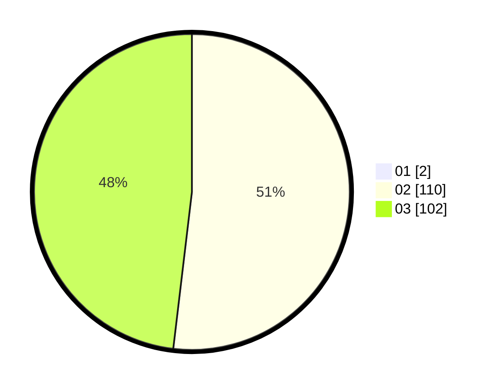

# Hasil

Hasil perolehan suara paslon dapat dilihat pada file paslon-01.txt, paslon-02.txt, dan paslon-03.txt.

Jika tidak ada, artinya data tersebut belum ada pada SIREKAP.

## Perolehan Suara

 * Paslon 01: **2**.
 * Paslon 02: **110**.
 * Paslon 03: **102**.

## Foto C Plano

https://sirekap-obj-formc.kpu.go.id/21f3/pemilu/ppwp/31/72/01/10/03/3172011003119-20240216-192824--e3e099ad-bea2-4f74-a936-3c29e88ca1b4.jpg

https://sirekap-obj-formc.kpu.go.id/21f3/pemilu/ppwp/31/72/01/10/03/3172011003119-20240216-192215--a8fcc053-7ce1-4772-ad46-2e7db349cf47.jpg

https://sirekap-obj-formc.kpu.go.id/21f3/pemilu/ppwp/31/72/01/10/03/3172011003119-20240216-192252--29b3aed2-a4b7-4ab2-9ffa-b269d7c9c9ed.jpg

## DATA PEMILIH TETAP

Jumlah pemilih dalam DPT: **268**.
 * L: **124**.
 * P: **144**.

## DATA PENGGUNA HAK PILIH

Jumlah pengguna hak pilih dalam DPT: **198**.
 * L: **93**.
 * P: **105**.

Jumlah pengguna hak pilih dalam DPTb: **8**.
 * L: **3**.
 * P: **5**.

Jumlah pengguna hak pilih dalam DPK: **10**.
 * L: **5**.
 * P: **5**.

Jumlah pengguna hak pilih: **216**.
 * L: **101**.
 * P: **115**.

## JUMLAH SUARA SAH DAN TIDAK SAH

JUMLAH SELURUH SUARA SAH: **214**.

JUMLAH SUARA TIDAK SAH: **2**.

JUMLAH SELURUH SUARA SAH DAN SUARA TIDAK SAH: **216**.
