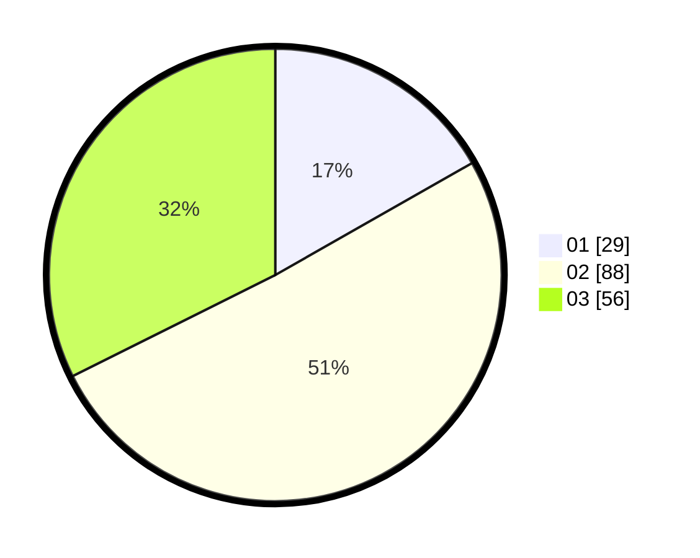

# Hasil

Hasil perolehan suara paslon dapat dilihat pada file paslon-01.txt, paslon-02.txt, dan paslon-03.txt.

Jika tidak ada, artinya data tersebut belum ada pada SIREKAP.

## Perolehan Suara

 * Paslon 01: **29**.
 * Paslon 02: **88**.
 * Paslon 03: **56**.

## Foto C Plano

https://sirekap-obj-formc.kpu.go.id/ff94/pemilu/ppwp/31/72/01/10/04/3172011004003-20240216-173704--da527fc5-b0c3-4d9c-8ee9-6a19457b3f40.jpg

https://sirekap-obj-formc.kpu.go.id/ff94/pemilu/ppwp/31/72/01/10/04/3172011004003-20240216-174900--5f9815fd-ea9d-4781-b3d4-1c02f358cdbc.jpg

https://sirekap-obj-formc.kpu.go.id/ff94/pemilu/ppwp/31/72/01/10/04/3172011004003-20240216-175446--2fd10183-284e-4e8d-ba80-9092e39b07e4.jpg

## DATA PEMILIH TETAP

Jumlah pemilih dalam DPT: **273**.
 * L: **135**.
 * P: **138**.

## DATA PENGGUNA HAK PILIH

Jumlah pengguna hak pilih dalam DPT: **178**.
 * L: **84**.
 * P: **94**.

Jumlah pengguna hak pilih dalam DPTb: **0**.
 * L: **0**.
 * P: **0**.

Jumlah pengguna hak pilih dalam DPK: **0**.
 * L: **0**.
 * P: **0**.

Jumlah pengguna hak pilih: **178**.
 * L: **84**.
 * P: **94**.

## JUMLAH SUARA SAH DAN TIDAK SAH

JUMLAH SELURUH SUARA SAH: **173**.

JUMLAH SUARA TIDAK SAH: **5**.

JUMLAH SELURUH SUARA SAH DAN SUARA TIDAK SAH: **178**.
