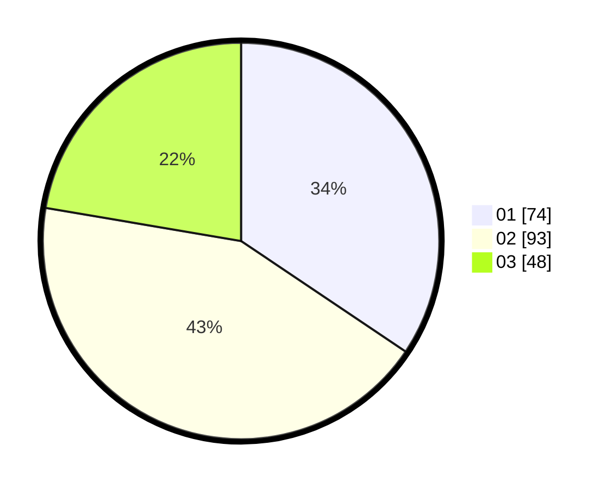

# Hasil

Hasil perolehan suara paslon dapat dilihat pada file paslon-01.txt, paslon-02.txt, dan paslon-03.txt.

Jika tidak ada, artinya data tersebut belum ada pada SIREKAP.

## Perolehan Suara

 * Paslon 01: **74**.
 * Paslon 02: **93**.
 * Paslon 03: **48**.

## Foto C Plano

https://sirekap-obj-formc.kpu.go.id/5770/pemilu/ppwp/31/72/01/10/04/3172011004005-20240218-163206--111dae5c-ee4c-4306-a24a-9d700093ac8a.jpg

https://sirekap-obj-formc.kpu.go.id/5770/pemilu/ppwp/31/72/01/10/04/3172011004005-20240218-163606--e1bd5bd2-5eeb-4ac9-952c-97161684cc07.jpg

https://sirekap-obj-formc.kpu.go.id/5770/pemilu/ppwp/31/72/01/10/04/3172011004005-20240218-163632--95e7584a-e3d3-4808-b40f-581624f17b0b.jpg

## DATA PEMILIH TETAP

Jumlah pemilih dalam DPT: **747**.
 * L: **145**.
 * P: **174**.

## DATA PENGGUNA HAK PILIH

Jumlah pengguna hak pilih dalam DPT: **719**.
 * L: **114**.
 * P: **504**.

Jumlah pengguna hak pilih dalam DPTb: **0**.
 * L: **0**.
 * P: **0**.

Jumlah pengguna hak pilih dalam DPK: **0**.
 * L: **0**.
 * P: **0**.

Jumlah pengguna hak pilih: **214**.
 * L: **114**.
 * P: **104**.

## JUMLAH SUARA SAH DAN TIDAK SAH

JUMLAH SELURUH SUARA SAH: **215**.

JUMLAH SUARA TIDAK SAH: **4**.

JUMLAH SELURUH SUARA SAH DAN SUARA TIDAK SAH: **214**.
