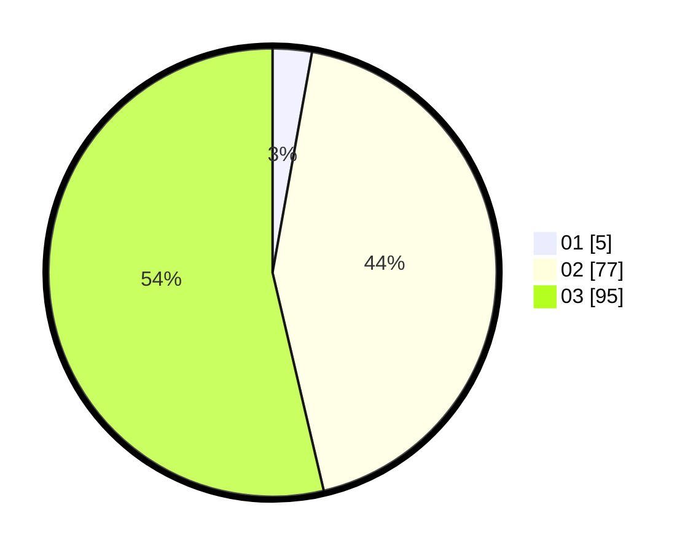

# Hasil

Hasil perolehan suara paslon dapat dilihat pada file paslon-01.txt, paslon-02.txt, dan paslon-03.txt.

Jika tidak ada, artinya data tersebut belum ada pada SIREKAP.

## Perolehan Suara

 * Paslon 01: **5**.
 * Paslon 02: **77**.
 * Paslon 03: **95**.

## Foto C Plano

https://sirekap-obj-formc.kpu.go.id/ed23/pemilu/ppwp/31/72/01/10/04/3172011004008-20240219-171309--67e319d6-0ec6-4b64-add7-da46469ac474.jpg

https://sirekap-obj-formc.kpu.go.id/ed23/pemilu/ppwp/31/72/01/10/04/3172011004008-20240219-171536--28da55b5-2c57-4058-9726-63c47be7b3b2.jpg

https://sirekap-obj-formc.kpu.go.id/ed23/pemilu/ppwp/31/72/01/10/04/3172011004008-20240219-171642--76e4ae48-f297-46ca-b0ff-158c0388b488.jpg

## DATA PEMILIH TETAP

Jumlah pemilih dalam DPT: **285**.
 * L: **146**.
 * P: **139**.

## DATA PENGGUNA HAK PILIH

Jumlah pengguna hak pilih dalam DPT: **175**.
 * L: **91**.
 * P: **84**.

Jumlah pengguna hak pilih dalam DPTb: **4**.
 * L: **2**.
 * P: **2**.

Jumlah pengguna hak pilih dalam DPK: **0**.
 * L: **0**.
 * P: **0**.

Jumlah pengguna hak pilih: **179**.
 * L: **93**.
 * P: **86**.

## JUMLAH SUARA SAH DAN TIDAK SAH

JUMLAH SELURUH SUARA SAH: **177**.

JUMLAH SUARA TIDAK SAH: **2**.

JUMLAH SELURUH SUARA SAH DAN SUARA TIDAK SAH: **179**.
