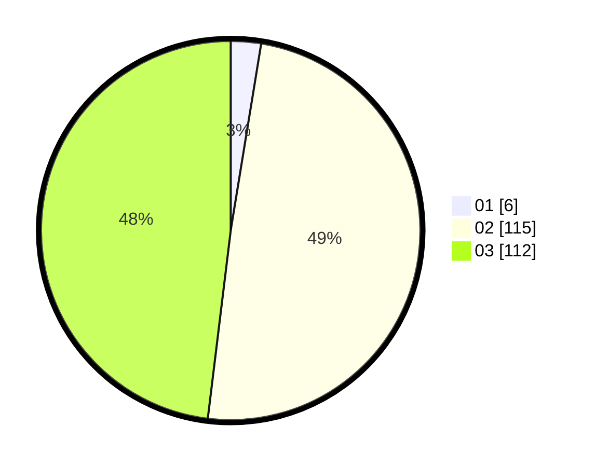

# Hasil

Hasil perolehan suara paslon dapat dilihat pada file paslon-01.txt, paslon-02.txt, dan paslon-03.txt.

Jika tidak ada, artinya data tersebut belum ada pada SIREKAP.

## Perolehan Suara

 * Paslon 01: **6**.
 * Paslon 02: **115**.
 * Paslon 03: **112**.

## Foto C Plano

https://sirekap-obj-formc.kpu.go.id/9840/pemilu/ppwp/31/72/01/10/04/3172011004015-20240217-110742--029abd41-2dd7-4e31-8270-2a6dec1e272e.jpg

https://sirekap-obj-formc.kpu.go.id/9840/pemilu/ppwp/31/72/01/10/04/3172011004015-20240217-110809--f3bf5f99-30cf-4f56-b096-19a5378b2088.jpg

https://sirekap-obj-formc.kpu.go.id/9840/pemilu/ppwp/31/72/01/10/04/3172011004015-20240217-110836--9a32401b-c371-48d6-a70b-c361b490f23c.jpg

## DATA PEMILIH TETAP

Jumlah pemilih dalam DPT: **285**.
 * L: **138**.
 * P: **147**.

## DATA PENGGUNA HAK PILIH

Jumlah pengguna hak pilih dalam DPT: **209**.
 * L: **702**.
 * P: **167**.

Jumlah pengguna hak pilih dalam DPTb: **222**.
 * L: **1**.
 * P: **200**.

Jumlah pengguna hak pilih dalam DPK: **25**.
 * L: **12**.
 * P: **13**.

Jumlah pengguna hak pilih: **235**.
 * L: **15**.
 * P: **120**.

## JUMLAH SUARA SAH DAN TIDAK SAH

JUMLAH SELURUH SUARA SAH: **233**.

JUMLAH SUARA TIDAK SAH: **1**.

JUMLAH SELURUH SUARA SAH DAN SUARA TIDAK SAH: **234**.
