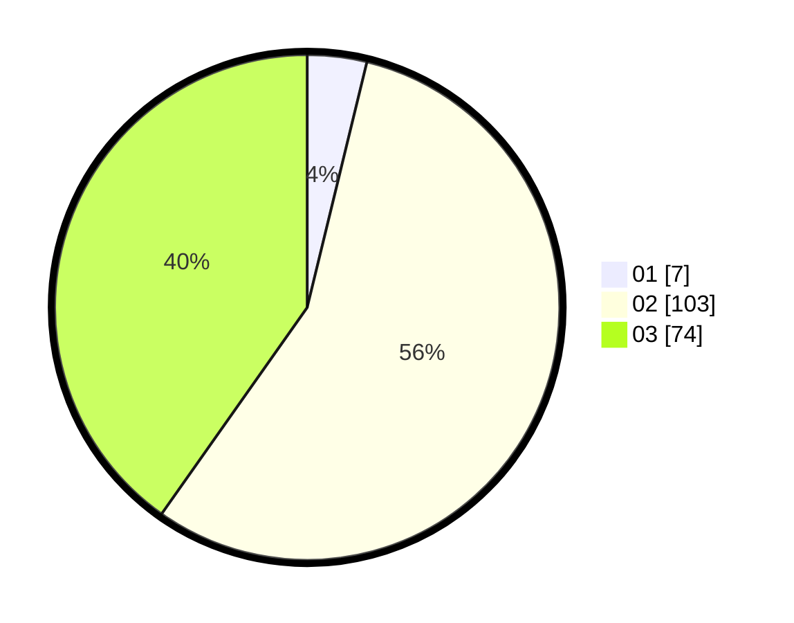

# Hasil

Hasil perolehan suara paslon dapat dilihat pada file paslon-01.txt, paslon-02.txt, dan paslon-03.txt.

Jika tidak ada, artinya data tersebut belum ada pada SIREKAP.

## Perolehan Suara

 * Paslon 01: **7**.
 * Paslon 02: **103**.
 * Paslon 03: **74**.

## Foto C Plano

https://sirekap-obj-formc.kpu.go.id/ccb7/pemilu/ppwp/31/72/01/10/04/3172011004018-20240217-113656--1320d442-10d3-4445-bcec-2329be50bc35.jpg

https://sirekap-obj-formc.kpu.go.id/ccb7/pemilu/ppwp/31/72/01/10/04/3172011004018-20240217-113446--095b5d96-6c48-47e8-8659-32ac97346734.jpg

https://sirekap-obj-formc.kpu.go.id/ccb7/pemilu/ppwp/31/72/01/10/04/3172011004018-20240217-113552--b715c588-132b-4bde-9500-638ee4d8862c.jpg

## DATA PEMILIH TETAP

Jumlah pemilih dalam DPT: **277**.
 * L: **437**.
 * P: **140**.

## DATA PENGGUNA HAK PILIH

Jumlah pengguna hak pilih dalam DPT: **181**.
 * L: **89**.
 * P: **92**.

Jumlah pengguna hak pilih dalam DPTb: **888**.
 * L: **80**.
 * P: **808**.

Jumlah pengguna hak pilih dalam DPK: **3**.
 * L: **1**.
 * P: **2**.

Jumlah pengguna hak pilih: **184**.
 * L: **90**.
 * P: **94**.

## JUMLAH SUARA SAH DAN TIDAK SAH

JUMLAH SELURUH SUARA SAH: **184**.

JUMLAH SUARA TIDAK SAH: **0**.

JUMLAH SELURUH SUARA SAH DAN SUARA TIDAK SAH: **184**.
