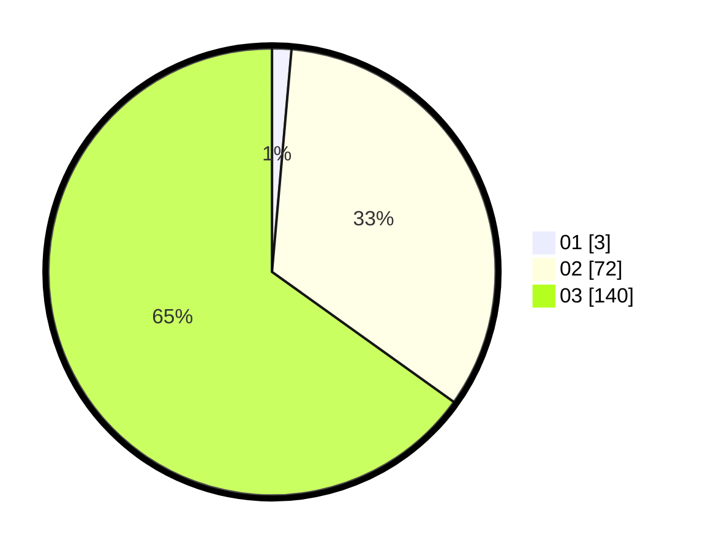

# Hasil

Hasil perolehan suara paslon dapat dilihat pada file paslon-01.txt, paslon-02.txt, dan paslon-03.txt.

Jika tidak ada, artinya data tersebut belum ada pada SIREKAP.

## Perolehan Suara

 * Paslon 01: **3**.
 * Paslon 02: **72**.
 * Paslon 03: **140**.

## Foto C Plano

https://sirekap-obj-formc.kpu.go.id/7cd7/pemilu/ppwp/31/72/01/10/04/3172011004021-20240217-113749--54814c44-1485-4ec8-8546-79dae9b1c20e.jpg

https://sirekap-obj-formc.kpu.go.id/7cd7/pemilu/ppwp/31/72/01/10/04/3172011004021-20240217-113833--fd44f210-2699-40bd-a6e4-5ed3791ad9a3.jpg

https://sirekap-obj-formc.kpu.go.id/7cd7/pemilu/ppwp/31/72/01/10/04/3172011004021-20240218-175043--fb0cfbb2-4ddd-4944-9bc7-b43c4f512676.jpg
