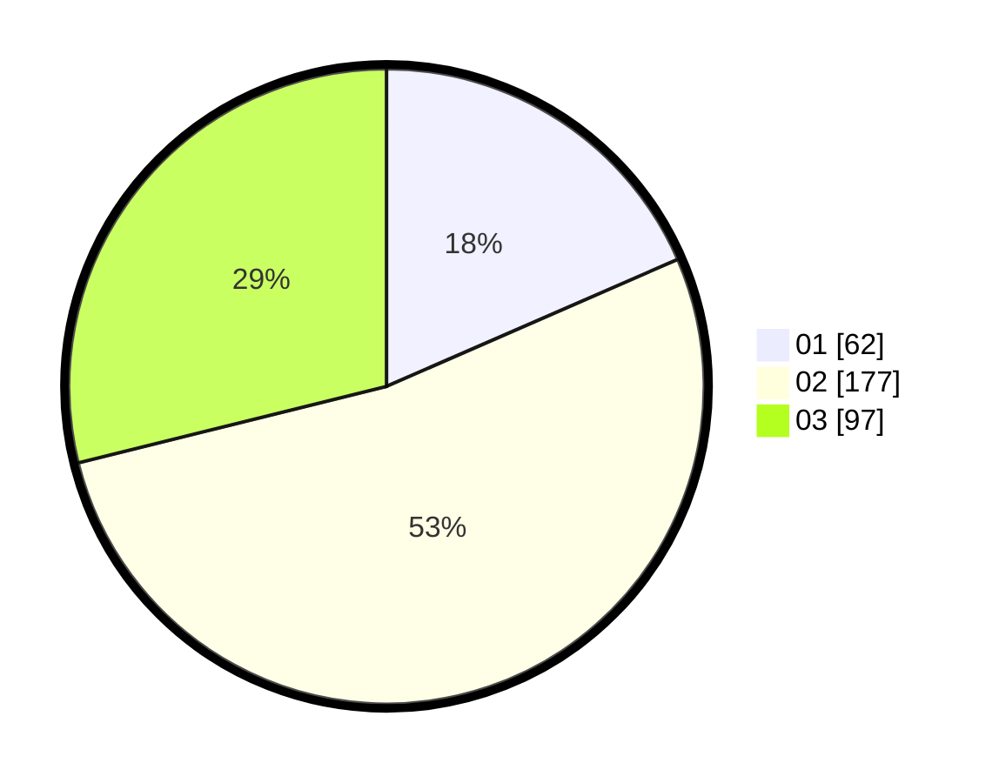

# Hasil

Hasil perolehan suara paslon dapat dilihat pada file paslon-01.txt, paslon-02.txt, dan paslon-03.txt.

Jika tidak ada, artinya data tersebut belum ada pada SIREKAP.

## Perolehan Suara

 * Paslon 01: **62**.
 * Paslon 02: **177**.
 * Paslon 03: **97**.

## Foto C Plano

https://sirekap-obj-formc.kpu.go.id/7fd7/pemilu/ppwp/31/72/01/10/04/3172011004022-20240217-113855--2304304a-906d-40b4-9217-bfb2ac330a04.jpg

https://sirekap-obj-formc.kpu.go.id/7fd7/pemilu/ppwp/31/72/01/10/04/3172011004022-20240217-113920--249e7575-e118-4c99-afc1-fe1907faea18.jpg

https://sirekap-obj-formc.kpu.go.id/7fd7/pemilu/ppwp/31/72/01/10/04/3172011004022-20240217-113955--ddbb97f6-1088-4c51-accc-2540bfb11c3d.jpg

## DATA PEMILIH TETAP

Jumlah pemilih dalam DPT: **296**.
 * L: **500**.
 * P: **7**.

## DATA PENGGUNA HAK PILIH

Jumlah pengguna hak pilih dalam DPT: **782**.
 * L: **75**.
 * P: **707**.

Jumlah pengguna hak pilih dalam DPTb: **442**.
 * L: **7**.
 * P: **274**.

Jumlah pengguna hak pilih dalam DPK: **1**.
 * L: **2**.
 * P: **1**.

Jumlah pengguna hak pilih: **619**.
 * L: **770**.
 * P: **109**.

## JUMLAH SUARA SAH DAN TIDAK SAH

JUMLAH SELURUH SUARA SAH: **196**.

JUMLAH SUARA TIDAK SAH: **1**.

JUMLAH SELURUH SUARA SAH DAN SUARA TIDAK SAH: **777**.
