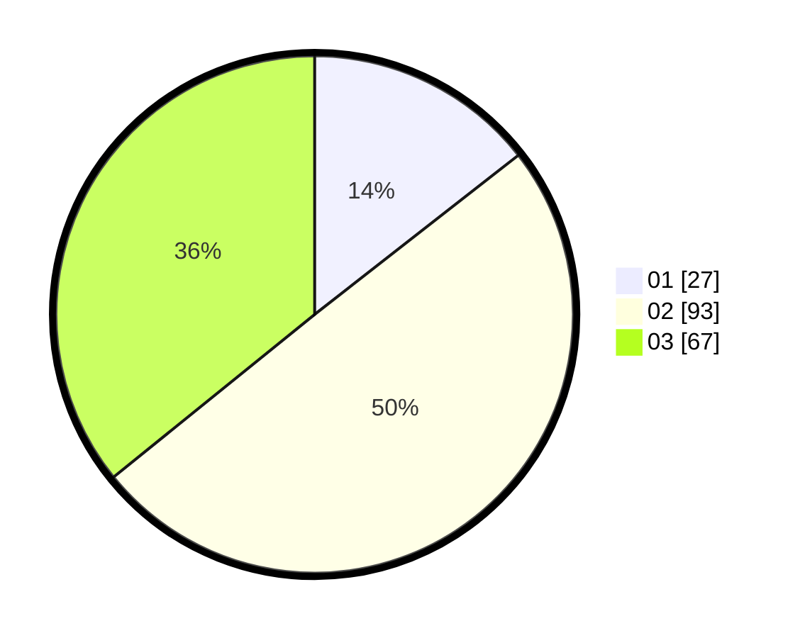

# Hasil

Hasil perolehan suara paslon dapat dilihat pada file paslon-01.txt, paslon-02.txt, dan paslon-03.txt.

Jika tidak ada, artinya data tersebut belum ada pada SIREKAP.

## Perolehan Suara

 * Paslon 01: **27**.
 * Paslon 02: **93**.
 * Paslon 03: **67**.

## Foto C Plano

https://sirekap-obj-formc.kpu.go.id/6443/pemilu/ppwp/31/72/01/10/04/3172011004025-20240214-160113--cab5dd68-1101-4445-9954-45ca871896b8.jpg

https://sirekap-obj-formc.kpu.go.id/6443/pemilu/ppwp/31/72/01/10/04/3172011004025-20240214-155638--405fc76c-e209-4928-8108-ad3667cfbb7c.jpg

https://sirekap-obj-formc.kpu.go.id/6443/pemilu/ppwp/31/72/01/10/04/3172011004025-20240214-155906--1abea8e9-2aa5-43ec-84ac-9f769c3584ed.jpg

## DATA PEMILIH TETAP

Jumlah pemilih dalam DPT: **290**.
 * L: **143**.
 * P: **147**.

## DATA PENGGUNA HAK PILIH

Jumlah pengguna hak pilih dalam DPT: **189**.
 * L: **88**.
 * P: **101**.

Jumlah pengguna hak pilih dalam DPTb: **0**.
 * L: **0**.
 * P: **0**.

Jumlah pengguna hak pilih dalam DPK: **0**.
 * L: **0**.
 * P: **0**.

Jumlah pengguna hak pilih: **189**.
 * L: **88**.
 * P: **101**.

## JUMLAH SUARA SAH DAN TIDAK SAH

JUMLAH SELURUH SUARA SAH: **187**.

JUMLAH SUARA TIDAK SAH: **2**.

JUMLAH SELURUH SUARA SAH DAN SUARA TIDAK SAH: **189**.
