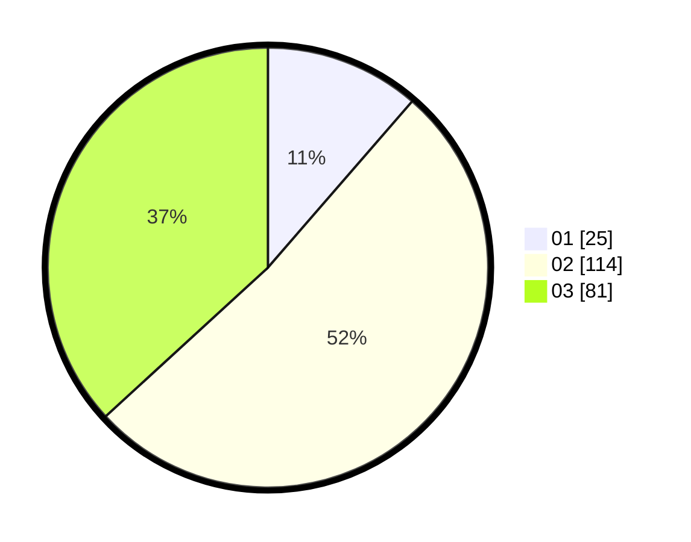

# Hasil

Hasil perolehan suara paslon dapat dilihat pada file paslon-01.txt, paslon-02.txt, dan paslon-03.txt.

Jika tidak ada, artinya data tersebut belum ada pada SIREKAP.

## Perolehan Suara

 * Paslon 01: **25**.
 * Paslon 02: **114**.
 * Paslon 03: **81**.

## Foto C Plano

https://sirekap-obj-formc.kpu.go.id/0484/pemilu/ppwp/31/72/01/10/04/3172011004026-20240217-114928--7204ffed-da1b-435b-8a10-9d08b0b03bef.jpg

https://sirekap-obj-formc.kpu.go.id/0484/pemilu/ppwp/31/72/01/10/04/3172011004026-20240217-115421--6dc6be06-f864-44eb-95cb-cee205ef4026.jpg

https://sirekap-obj-formc.kpu.go.id/0484/pemilu/ppwp/31/72/01/10/04/3172011004026-20240217-115642--c90b7ac1-dc72-492f-90ce-cae930b8933e.jpg

## DATA PEMILIH TETAP

Jumlah pemilih dalam DPT: **285**.
 * L: **754**.
 * P: **132**.

## DATA PENGGUNA HAK PILIH

Jumlah pengguna hak pilih dalam DPT: **217**.
 * L: **114**.
 * P: **203**.

Jumlah pengguna hak pilih dalam DPTb: **1**.
 * L: **1**.
 * P: **0**.

Jumlah pengguna hak pilih dalam DPK: **1**.
 * L: **1**.
 * P: **0**.

Jumlah pengguna hak pilih: **219**.
 * L: **416**.
 * P: **103**.

## JUMLAH SUARA SAH DAN TIDAK SAH

JUMLAH SELURUH SUARA SAH: **217**.

JUMLAH SUARA TIDAK SAH: **2**.

JUMLAH SELURUH SUARA SAH DAN SUARA TIDAK SAH: **219**.
