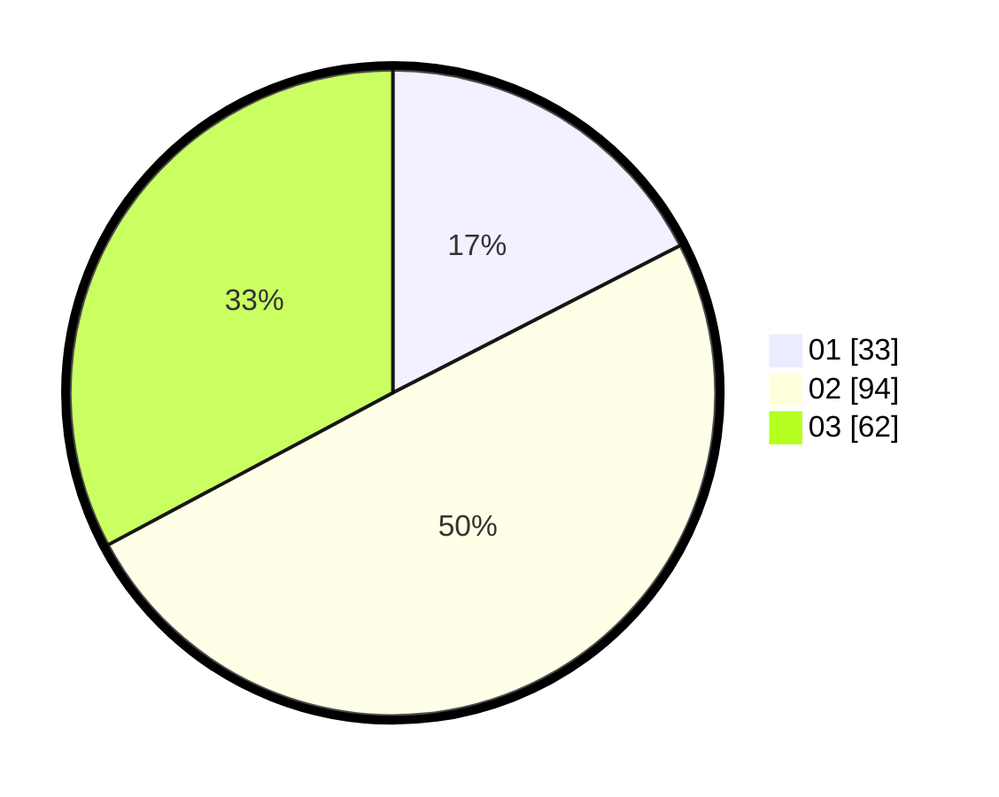

# Hasil

Hasil perolehan suara paslon dapat dilihat pada file paslon-01.txt, paslon-02.txt, dan paslon-03.txt.

Jika tidak ada, artinya data tersebut belum ada pada SIREKAP.

## Perolehan Suara

 * Paslon 01: **33**.
 * Paslon 02: **94**.
 * Paslon 03: **62**.

## Foto C Plano

https://sirekap-obj-formc.kpu.go.id/5cc4/pemilu/ppwp/31/72/01/10/04/3172011004028-20240217-115932--e9d4dd74-9db8-406c-98ba-0a53d120dc03.jpg

https://sirekap-obj-formc.kpu.go.id/5cc4/pemilu/ppwp/31/72/01/10/04/3172011004028-20240217-120118--184dab16-5833-4739-8d21-88a9aa28b457.jpg

https://sirekap-obj-formc.kpu.go.id/5cc4/pemilu/ppwp/31/72/01/10/04/3172011004028-20240217-120137--9c02fafe-602e-402e-8bec-3b7811b1bb71.jpg

## DATA PEMILIH TETAP

Jumlah pemilih dalam DPT: **227**.
 * L: **455**.
 * P: **132**.

## DATA PENGGUNA HAK PILIH

Jumlah pengguna hak pilih dalam DPT: **107**.
 * L: **101**.
 * P: **29**.

Jumlah pengguna hak pilih dalam DPTb: **3**.
 * L: **26**.
 * P: **231**.

Jumlah pengguna hak pilih dalam DPK: **0**.
 * L: **0**.
 * P: **0**.

Jumlah pengguna hak pilih: **192**.
 * L: **103**.
 * P: **9**.

## JUMLAH SUARA SAH DAN TIDAK SAH

JUMLAH SELURUH SUARA SAH: **189**.

JUMLAH SUARA TIDAK SAH: **3**.

JUMLAH SELURUH SUARA SAH DAN SUARA TIDAK SAH: **192**.
