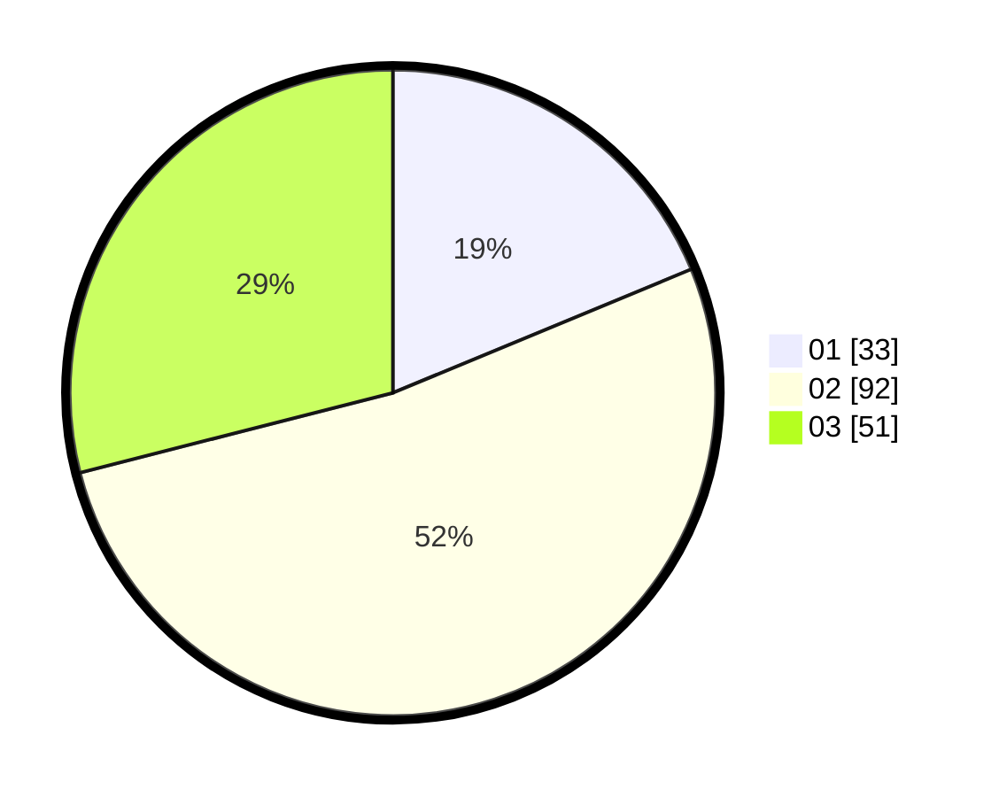

# Hasil

Hasil perolehan suara paslon dapat dilihat pada file paslon-01.txt, paslon-02.txt, dan paslon-03.txt.

Jika tidak ada, artinya data tersebut belum ada pada SIREKAP.

## Perolehan Suara

 * Paslon 01: **33**.
 * Paslon 02: **92**.
 * Paslon 03: **51**.

## Foto C Plano

https://sirekap-obj-formc.kpu.go.id/5c1c/pemilu/ppwp/31/72/01/10/04/3172011004030-20240217-120321--88fe873e-5dc7-4488-8b9b-2002c2e159d7.jpg

https://sirekap-obj-formc.kpu.go.id/5c1c/pemilu/ppwp/31/72/01/10/04/3172011004030-20240217-120339--e3a371e9-2406-4595-a28a-db029c6f1e4c.jpg

https://sirekap-obj-formc.kpu.go.id/5c1c/pemilu/ppwp/31/72/01/10/04/3172011004030-20240217-120356--cf429913-e54f-4c2d-b447-b5437f98804c.jpg

## DATA PEMILIH TETAP

Jumlah pemilih dalam DPT: **263**.
 * L: **134**.
 * P: **129**.

## DATA PENGGUNA HAK PILIH

Jumlah pengguna hak pilih dalam DPT: **176**.
 * L: **91**.
 * P: **85**.

Jumlah pengguna hak pilih dalam DPTb: **872**.
 * L: **75**.
 * P: **707**.

Jumlah pengguna hak pilih dalam DPK: **1**.
 * L: **705**.
 * P: **400**.

Jumlah pengguna hak pilih: **179**.
 * L: **53**.
 * P: **86**.

## JUMLAH SUARA SAH DAN TIDAK SAH

JUMLAH SELURUH SUARA SAH: **176**.

JUMLAH SUARA TIDAK SAH: **3**.

JUMLAH SELURUH SUARA SAH DAN SUARA TIDAK SAH: **179**.
