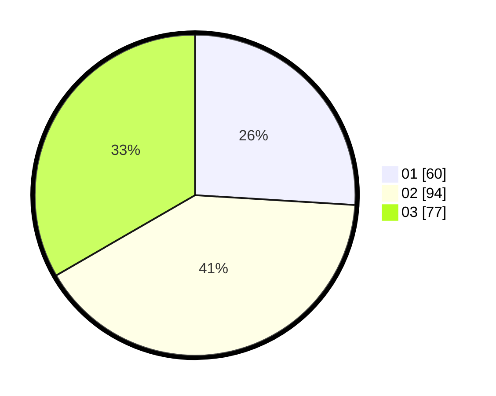

# Hasil

Hasil perolehan suara paslon dapat dilihat pada file paslon-01.txt, paslon-02.txt, dan paslon-03.txt.

Jika tidak ada, artinya data tersebut belum ada pada SIREKAP.

## Perolehan Suara

 * Paslon 01: **60**.
 * Paslon 02: **94**.
 * Paslon 03: **77**.

## Foto C Plano

https://sirekap-obj-formc.kpu.go.id/6743/pemilu/ppwp/31/72/01/10/04/3172011004101-20240215-013408--ee946d86-9b10-4939-9ba0-7db317b1c4f4.jpg

https://sirekap-obj-formc.kpu.go.id/6743/pemilu/ppwp/31/72/01/10/04/3172011004101-20240214-155817--df972385-6950-4d9d-ba60-880902ed75c2.jpg

https://sirekap-obj-formc.kpu.go.id/6743/pemilu/ppwp/31/72/01/10/04/3172011004101-20240214-184514--20317191-0252-4c79-8485-c5211f133f3f.jpg
