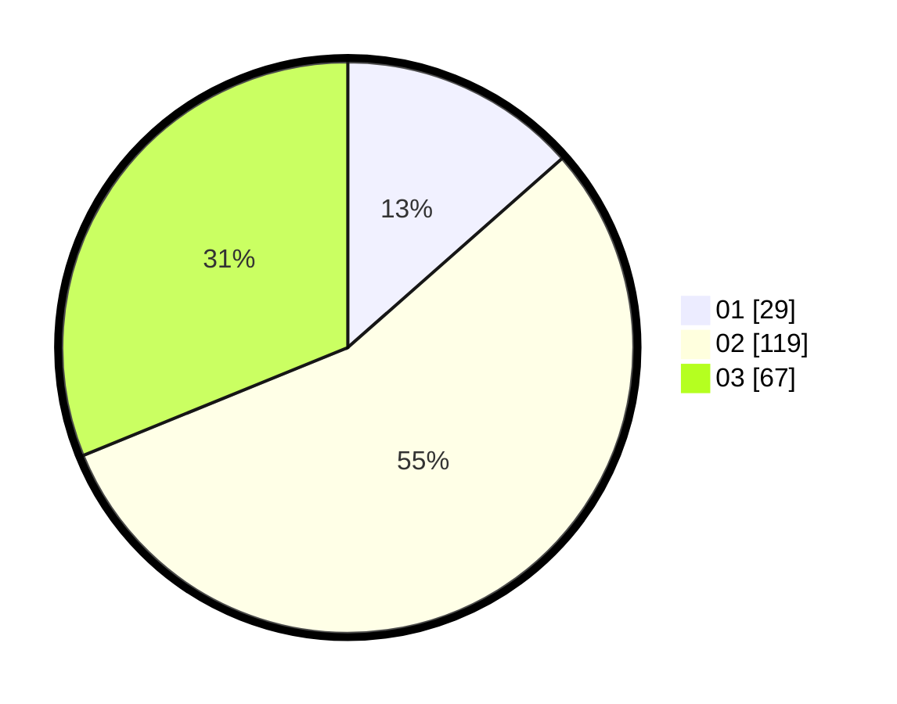

# Hasil

Hasil perolehan suara paslon dapat dilihat pada file paslon-01.txt, paslon-02.txt, dan paslon-03.txt.

Jika tidak ada, artinya data tersebut belum ada pada SIREKAP.

## Perolehan Suara

 * Paslon 01: **29**.
 * Paslon 02: **119**.
 * Paslon 03: **67**.

## Foto C Plano

https://sirekap-obj-formc.kpu.go.id/cfb7/pemilu/ppwp/31/72/01/10/04/3172011004109-20240214-215503--e246fdc7-82c8-4069-8101-f419c3073e83.jpg

https://sirekap-obj-formc.kpu.go.id/cfb7/pemilu/ppwp/31/72/01/10/04/3172011004109-20240214-215600--a9f14013-437d-4426-9302-58ac566b15e4.jpg

https://sirekap-obj-formc.kpu.go.id/cfb7/pemilu/ppwp/31/72/01/10/04/3172011004109-20240214-215635--604ede5a-f039-4fdf-8d7c-7fb9cbe2eb67.jpg

## DATA PEMILIH TETAP

Jumlah pemilih dalam DPT: **286**.
 * L: **141**.
 * P: **145**.

## DATA PENGGUNA HAK PILIH

Jumlah pengguna hak pilih dalam DPT: **208**.
 * L: **104**.
 * P: **104**.

Jumlah pengguna hak pilih dalam DPTb: **11**.
 * L: **5**.
 * P: **6**.

Jumlah pengguna hak pilih dalam DPK: **0**.
 * L: **0**.
 * P: **0**.

Jumlah pengguna hak pilih: **219**.
 * L: **109**.
 * P: **110**.

## JUMLAH SUARA SAH DAN TIDAK SAH

JUMLAH SELURUH SUARA SAH: **215**.

JUMLAH SUARA TIDAK SAH: **6**.

JUMLAH SELURUH SUARA SAH DAN SUARA TIDAK SAH: **221**.
