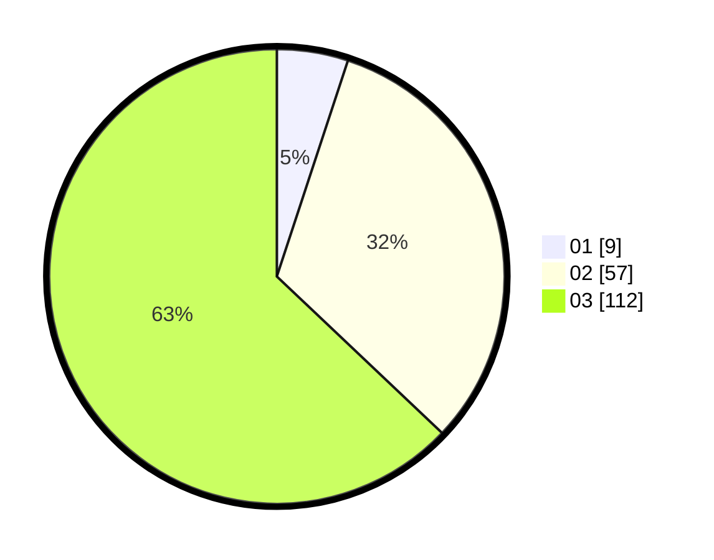

# Hasil

Hasil perolehan suara paslon dapat dilihat pada file paslon-01.txt, paslon-02.txt, dan paslon-03.txt.

Jika tidak ada, artinya data tersebut belum ada pada SIREKAP.

## Perolehan Suara

 * Paslon 01: **9**.
 * Paslon 02: **57**.
 * Paslon 03: **112**.

## Foto C Plano

https://sirekap-obj-formc.kpu.go.id/cf75/pemilu/ppwp/31/72/01/10/04/3172011004133-20240214-211025--65e5c9fb-26bc-4583-8567-f18573a9fb75.jpg

https://sirekap-obj-formc.kpu.go.id/cf75/pemilu/ppwp/31/72/01/10/04/3172011004133-20240216-013656--8a9f656d-5000-4913-bb63-064ab749083b.jpg

https://sirekap-obj-formc.kpu.go.id/cf75/pemilu/ppwp/31/72/01/10/04/3172011004133-20240214-210825--fb2af7f3-f2b7-41e0-9b7b-04ae3b21451c.jpg

## DATA PEMILIH TETAP

Jumlah pemilih dalam DPT: **288**.
 * L: **138**.
 * P: **150**.

## DATA PENGGUNA HAK PILIH

Jumlah pengguna hak pilih dalam DPT: **180**.
 * L: **81**.
 * P: **99**.

Jumlah pengguna hak pilih dalam DPTb: **1**.
 * L: **0**.
 * P: **1**.

Jumlah pengguna hak pilih dalam DPK: **2**.
 * L: **0**.
 * P: **2**.

Jumlah pengguna hak pilih: **183**.
 * L: **81**.
 * P: **102**.

## JUMLAH SUARA SAH DAN TIDAK SAH

JUMLAH SELURUH SUARA SAH: **178**.

JUMLAH SUARA TIDAK SAH: **5**.

JUMLAH SELURUH SUARA SAH DAN SUARA TIDAK SAH: **183**.
