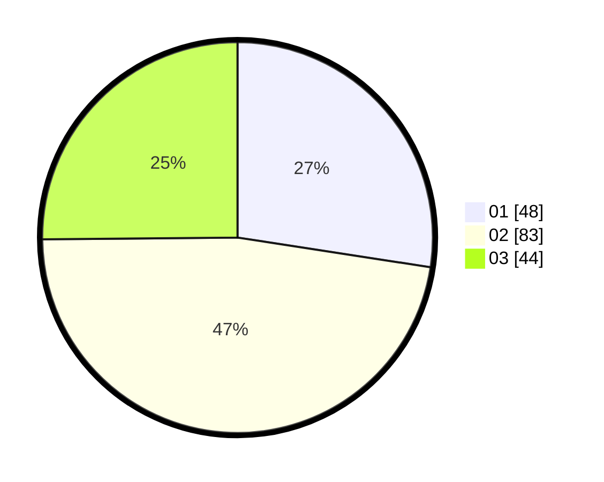

# Hasil

Hasil perolehan suara paslon dapat dilihat pada file paslon-01.txt, paslon-02.txt, dan paslon-03.txt.

Jika tidak ada, artinya data tersebut belum ada pada SIREKAP.

## Perolehan Suara

 * Paslon 01: **48**.
 * Paslon 02: **83**.
 * Paslon 03: **44**.

## Foto C Plano

https://sirekap-obj-formc.kpu.go.id/ec77/pemilu/ppwp/31/72/01/10/04/3172011004147-20240214-234449--b1d2bb67-1ae2-4d38-84b1-dd4975851c88.jpg

https://sirekap-obj-formc.kpu.go.id/ec77/pemilu/ppwp/31/72/01/10/04/3172011004147-20240214-234604--5f10b466-a135-4613-9813-5371fd44a310.jpg

https://sirekap-obj-formc.kpu.go.id/ec77/pemilu/ppwp/31/72/01/10/04/3172011004147-20240214-234700--a62e22ab-3acb-4fd2-aeac-7502656b5e3e.jpg

## DATA PEMILIH TETAP

Jumlah pemilih dalam DPT: **291**.
 * L: **143**.
 * P: **148**.

## DATA PENGGUNA HAK PILIH

Jumlah pengguna hak pilih dalam DPT: **180**.
 * L: **83**.
 * P: **97**.

Jumlah pengguna hak pilih dalam DPTb: **1**.
 * L: **1**.
 * P: **0**.

Jumlah pengguna hak pilih dalam DPK: **0**.
 * L: **0**.
 * P: **0**.

Jumlah pengguna hak pilih: **181**.
 * L: **84**.
 * P: **97**.

## JUMLAH SUARA SAH DAN TIDAK SAH

JUMLAH SELURUH SUARA SAH: **175**.

JUMLAH SUARA TIDAK SAH: **6**.

JUMLAH SELURUH SUARA SAH DAN SUARA TIDAK SAH: **181**.
