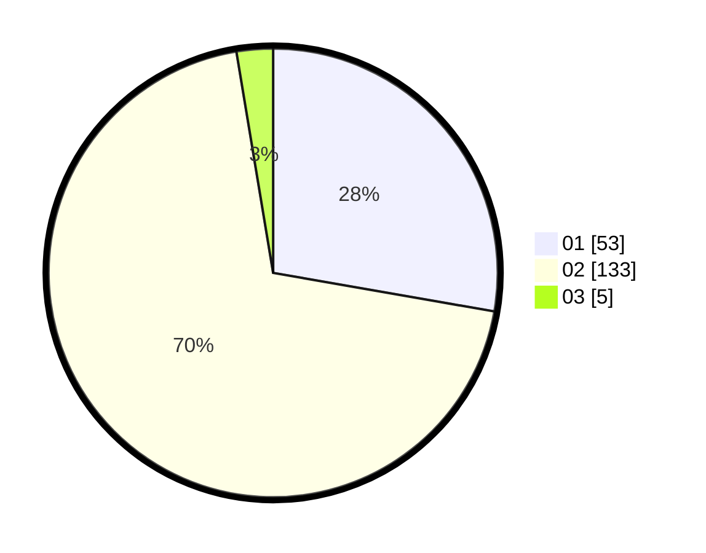

# Hasil

Hasil perolehan suara paslon dapat dilihat pada file paslon-01.txt, paslon-02.txt, dan paslon-03.txt.

Jika tidak ada, artinya data tersebut belum ada pada SIREKAP.

## Perolehan Suara

 * Paslon 01: **53**.
 * Paslon 02: **133**.
 * Paslon 03: **5**.

## Foto C Plano

https://sirekap-obj-formc.kpu.go.id/0f60/pemilu/ppwp/31/72/01/10/04/3172011004154-20240214-202239--a5d568ad-bcf0-4a6c-aad1-10b0b5235995.jpg

https://sirekap-obj-formc.kpu.go.id/0f60/pemilu/ppwp/31/72/01/10/04/3172011004154-20240214-202333--676b7290-c04e-4e23-9392-ae84addfd827.jpg

https://sirekap-obj-formc.kpu.go.id/0f60/pemilu/ppwp/31/72/01/10/04/3172011004154-20240214-215858--aec3f82a-d863-4f6c-b020-ca9002e4261a.jpg

## DATA PEMILIH TETAP

Jumlah pemilih dalam DPT: **273**.
 * L: **146**.
 * P: **127**.

## DATA PENGGUNA HAK PILIH

Jumlah pengguna hak pilih dalam DPT: **194**.
 * L: **98**.
 * P: **96**.

Jumlah pengguna hak pilih dalam DPTb: **0**.
 * L: **0**.
 * P: **0**.

Jumlah pengguna hak pilih dalam DPK: **4**.
 * L: **2**.
 * P: **2**.

Jumlah pengguna hak pilih: **198**.
 * L: **100**.
 * P: **98**.

## JUMLAH SUARA SAH DAN TIDAK SAH

JUMLAH SELURUH SUARA SAH: **191**.

JUMLAH SUARA TIDAK SAH: **7**.

JUMLAH SELURUH SUARA SAH DAN SUARA TIDAK SAH: **198**.
