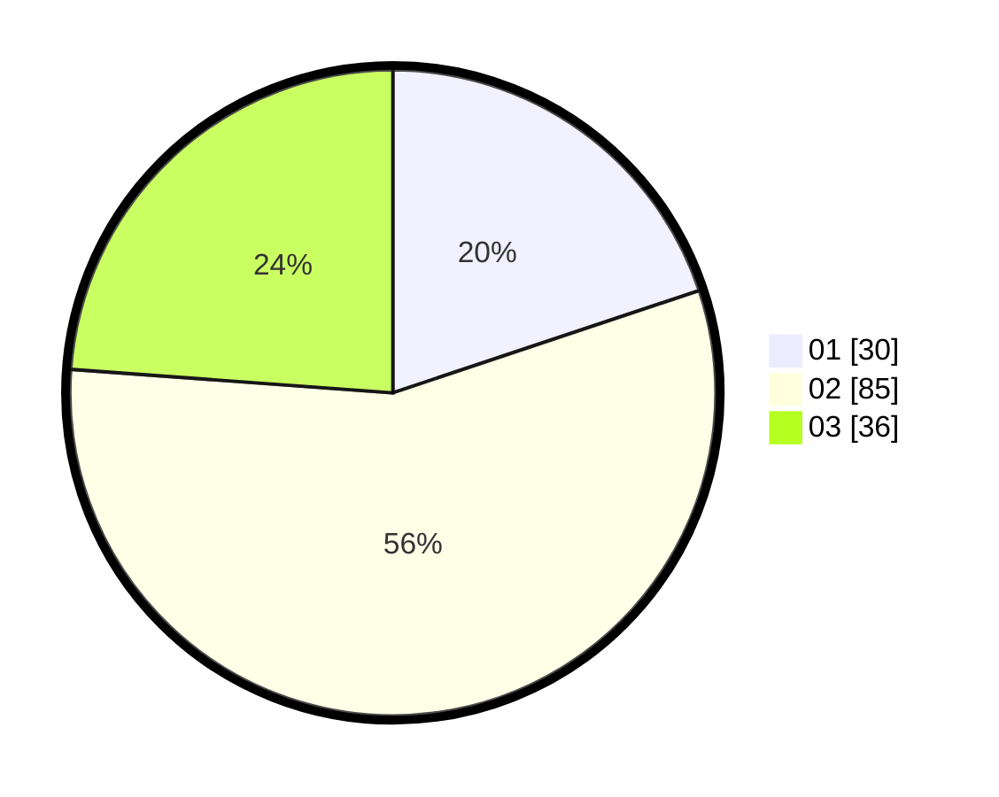

# Hasil

Hasil perolehan suara paslon dapat dilihat pada file paslon-01.txt, paslon-02.txt, dan paslon-03.txt.

Jika tidak ada, artinya data tersebut belum ada pada SIREKAP.

## Perolehan Suara

 * Paslon 01: **30**.
 * Paslon 02: **85**.
 * Paslon 03: **36**.

## Foto C Plano

https://sirekap-obj-formc.kpu.go.id/853b/pemilu/ppwp/31/72/01/10/04/3172011004180-20240214-155709--a6e6a11b-6055-498e-b0c4-5a89f1ae94c8.jpg

https://sirekap-obj-formc.kpu.go.id/853b/pemilu/ppwp/31/72/01/10/04/3172011004180-20240214-155737--3e4a4872-dcb3-47e6-b303-554c4e1484d4.jpg

https://sirekap-obj-formc.kpu.go.id/853b/pemilu/ppwp/31/72/01/10/04/3172011004180-20240214-155824--dd4e14ea-74b2-48b1-82a7-6d43198fad70.jpg

## DATA PEMILIH TETAP

Jumlah pemilih dalam DPT: **157**.
 * L: **15**.
 * P: **14**.

## DATA PENGGUNA HAK PILIH

Jumlah pengguna hak pilih dalam DPT: **247**.
 * L: **775**.
 * P: **777**.

Jumlah pengguna hak pilih dalam DPTb: **500**.
 * L: **700**.
 * P: **700**.

Jumlah pengguna hak pilih dalam DPK: **0**.
 * L: **0**.
 * P: **0**.

Jumlah pengguna hak pilih: **245**.
 * L: **117**.
 * P: **124**.

## JUMLAH SUARA SAH DAN TIDAK SAH

JUMLAH SELURUH SUARA SAH: **151**.

JUMLAH SUARA TIDAK SAH: **2**.

JUMLAH SELURUH SUARA SAH DAN SUARA TIDAK SAH: **153**.
