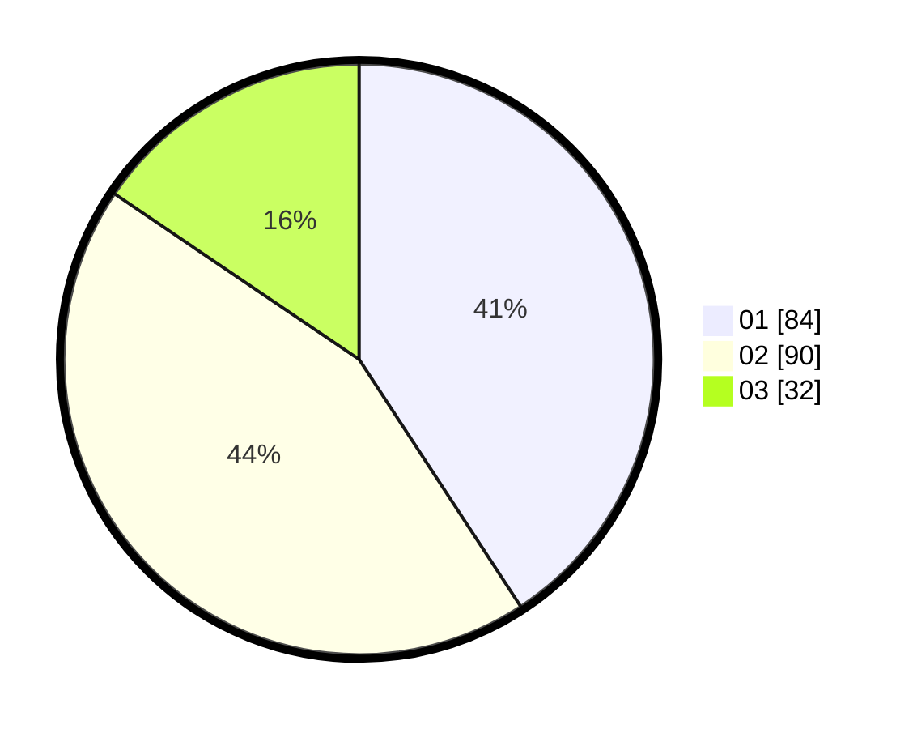

# Hasil

Hasil perolehan suara paslon dapat dilihat pada file paslon-01.txt, paslon-02.txt, dan paslon-03.txt.

Jika tidak ada, artinya data tersebut belum ada pada SIREKAP.

## Perolehan Suara

 * Paslon 01: **84**.
 * Paslon 02: **90**.
 * Paslon 03: **32**.

## Foto C Plano

https://sirekap-obj-formc.kpu.go.id/b481/pemilu/ppwp/31/72/01/10/04/3172011004188-20240214-202136--4e672dc1-b4ed-4735-8f21-f9e3996adc6e.jpg

https://sirekap-obj-formc.kpu.go.id/b481/pemilu/ppwp/31/72/01/10/04/3172011004188-20240214-224500--fbdeb246-a6aa-4eaa-8479-eebdf0526bcf.jpg

https://sirekap-obj-formc.kpu.go.id/b481/pemilu/ppwp/31/72/01/10/04/3172011004188-20240214-193559--8ed0e364-8772-41fc-afb5-c5ce168adcd2.jpg

## DATA PEMILIH TETAP

Jumlah pemilih dalam DPT: **293**.
 * L: **150**.
 * P: **143**.

## DATA PENGGUNA HAK PILIH

Jumlah pengguna hak pilih dalam DPT: **205**.
 * L: **98**.
 * P: **107**.

Jumlah pengguna hak pilih dalam DPTb: **7**.
 * L: **7**.
 * P: **0**.

Jumlah pengguna hak pilih dalam DPK: **0**.
 * L: **0**.
 * P: **0**.

Jumlah pengguna hak pilih: **206**.
 * L: **99**.
 * P: **107**.

## JUMLAH SUARA SAH DAN TIDAK SAH

JUMLAH SELURUH SUARA SAH: **206**.

JUMLAH SUARA TIDAK SAH: **0**.

JUMLAH SELURUH SUARA SAH DAN SUARA TIDAK SAH: **206**.
