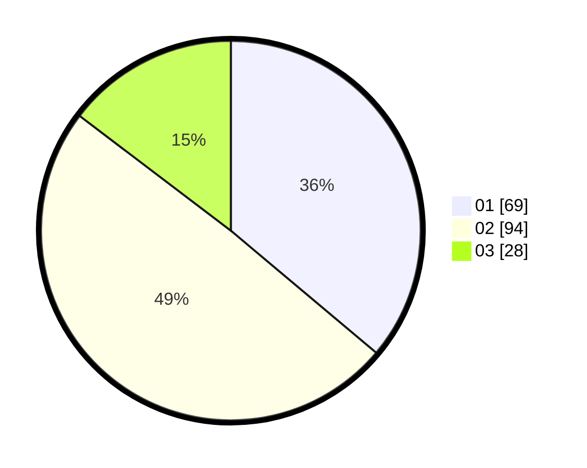

# Hasil

Hasil perolehan suara paslon dapat dilihat pada file paslon-01.txt, paslon-02.txt, dan paslon-03.txt.

Jika tidak ada, artinya data tersebut belum ada pada SIREKAP.

## Perolehan Suara

 * Paslon 01: **69**.
 * Paslon 02: **94**.
 * Paslon 03: **28**.

## Foto C Plano

https://sirekap-obj-formc.kpu.go.id/c8e9/pemilu/ppwp/31/72/01/10/04/3172011004223-20240214-155021--87844101-2fcd-497b-b32b-fbea5d432dea.jpg

https://sirekap-obj-formc.kpu.go.id/c8e9/pemilu/ppwp/31/72/01/10/04/3172011004223-20240214-191852--33846420-c3cf-40ff-802d-2b95a88200de.jpg

https://sirekap-obj-formc.kpu.go.id/c8e9/pemilu/ppwp/31/72/01/10/04/3172011004223-20240214-155212--8aa4587d-663b-4d8c-8103-2fb64d8b78f0.jpg

## DATA PEMILIH TETAP

Jumlah pemilih dalam DPT: **241**.
 * L: **131**.
 * P: **110**.

## DATA PENGGUNA HAK PILIH

Jumlah pengguna hak pilih dalam DPT: **187**.
 * L: **99**.
 * P: **88**.

Jumlah pengguna hak pilih dalam DPTb: **0**.
 * L: **0**.
 * P: **0**.

Jumlah pengguna hak pilih dalam DPK: **5**.
 * L: **3**.
 * P: **2**.

Jumlah pengguna hak pilih: **192**.
 * L: **102**.
 * P: **90**.

## JUMLAH SUARA SAH DAN TIDAK SAH

JUMLAH SELURUH SUARA SAH: **191**.

JUMLAH SUARA TIDAK SAH: **1**.

JUMLAH SELURUH SUARA SAH DAN SUARA TIDAK SAH: **192**.
