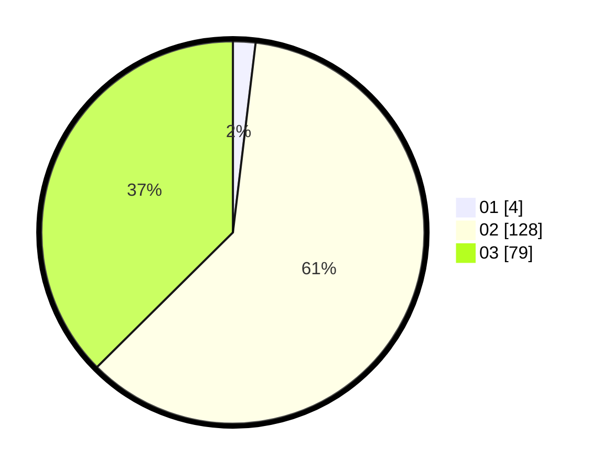

# Hasil

Hasil perolehan suara paslon dapat dilihat pada file paslon-01.txt, paslon-02.txt, dan paslon-03.txt.

Jika tidak ada, artinya data tersebut belum ada pada SIREKAP.

## Perolehan Suara

 * Paslon 01: **4**.
 * Paslon 02: **128**.
 * Paslon 03: **79**.

## Foto C Plano

https://sirekap-obj-formc.kpu.go.id/e720/pemilu/ppwp/31/72/01/10/04/3172011004233-20240214-201015--4b35a387-b5c5-461a-8684-5d3b0b6410e3.jpg

https://sirekap-obj-formc.kpu.go.id/e720/pemilu/ppwp/31/72/01/10/04/3172011004233-20240214-200057--087ec0b2-29a3-4b08-a168-ebeb545e0788.jpg

https://sirekap-obj-formc.kpu.go.id/e720/pemilu/ppwp/31/72/01/10/04/3172011004233-20240214-194726--66070aba-4aff-4ca5-adc5-37c41512d9a0.jpg
