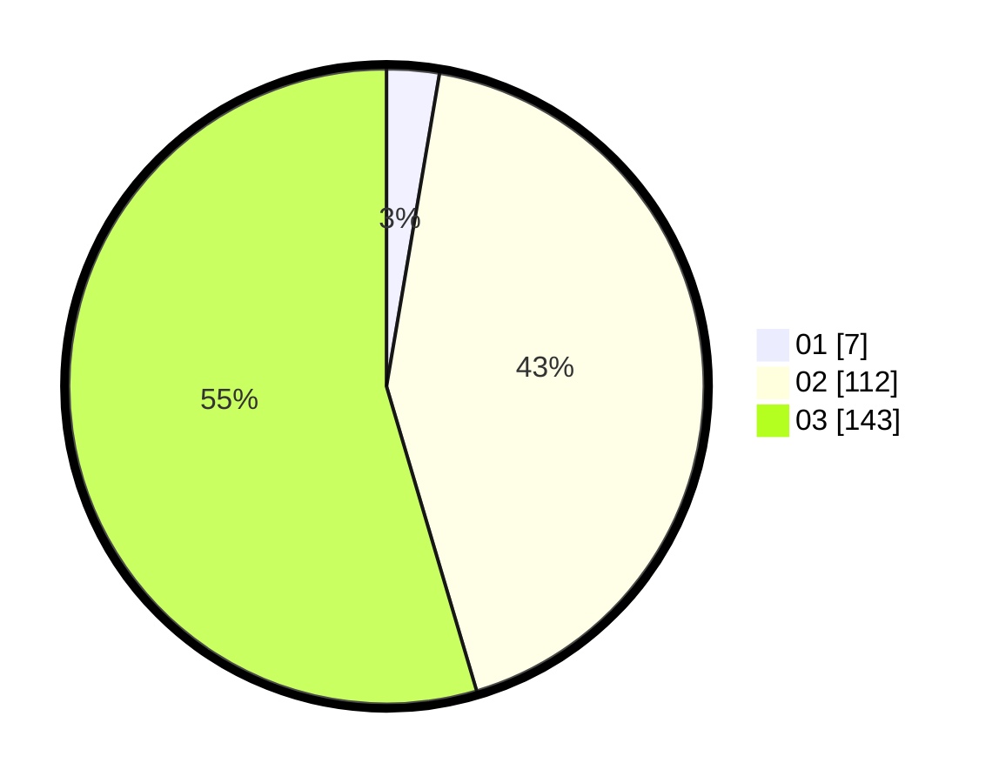

# Hasil

Hasil perolehan suara paslon dapat dilihat pada file paslon-01.txt, paslon-02.txt, dan paslon-03.txt.

Jika tidak ada, artinya data tersebut belum ada pada SIREKAP.

## Perolehan Suara

 * Paslon 01: **7**.
 * Paslon 02: **112**.
 * Paslon 03: **143**.

## Foto C Plano

https://sirekap-obj-formc.kpu.go.id/9d37/pemilu/ppwp/31/72/01/10/04/3172011004245-20240214-211604--916fc34f-b8f1-47ca-9b32-50b633da40a6.jpg

https://sirekap-obj-formc.kpu.go.id/9d37/pemilu/ppwp/31/72/01/10/04/3172011004245-20240214-194044--7646f6cd-bf74-4361-b2b8-831fce765a44.jpg

https://sirekap-obj-formc.kpu.go.id/9d37/pemilu/ppwp/31/72/01/10/04/3172011004245-20240214-220914--c512d35e-fc6d-4c70-83d5-49d8451f336e.jpg
