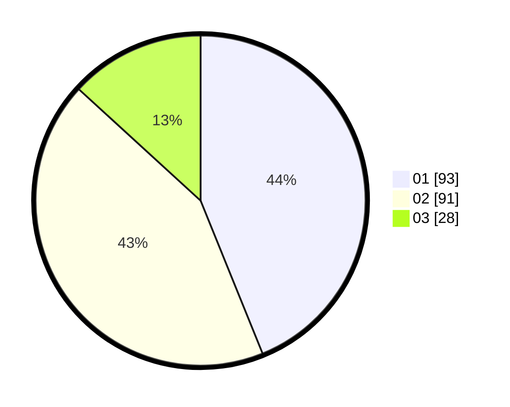

# Hasil

Hasil perolehan suara paslon dapat dilihat pada file paslon-01.txt, paslon-02.txt, dan paslon-03.txt.

Jika tidak ada, artinya data tersebut belum ada pada SIREKAP.

## Perolehan Suara

 * Paslon 01: **93**.
 * Paslon 02: **91**.
 * Paslon 03: **28**.

## Foto C Plano

https://sirekap-obj-formc.kpu.go.id/866d/pemilu/ppwp/31/72/01/10/05/3172011005001-20240216-135317--f6521822-5016-4a9a-9c24-3b73019db96b.jpg

https://sirekap-obj-formc.kpu.go.id/866d/pemilu/ppwp/31/72/01/10/05/3172011005001-20240216-135402--ea346500-70c4-490a-955c-48e63e4226ee.jpg

https://sirekap-obj-formc.kpu.go.id/866d/pemilu/ppwp/31/72/01/10/05/3172011005001-20240216-135437--e071e3ee-f207-4b30-9d93-6909ee50df25.jpg

## DATA PEMILIH TETAP

Jumlah pemilih dalam DPT: **288**.
 * L: **157**.
 * P: **131**.

## DATA PENGGUNA HAK PILIH

Jumlah pengguna hak pilih dalam DPT: **191**.
 * L: **94**.
 * P: **97**.

Jumlah pengguna hak pilih dalam DPTb: **5**.
 * L: **5**.
 * P: **0**.

Jumlah pengguna hak pilih dalam DPK: **18**.
 * L: **11**.
 * P: **7**.

Jumlah pengguna hak pilih: **214**.
 * L: **110**.
 * P: **104**.

## JUMLAH SUARA SAH DAN TIDAK SAH

JUMLAH SELURUH SUARA SAH: **212**.

JUMLAH SUARA TIDAK SAH: **2**.

JUMLAH SELURUH SUARA SAH DAN SUARA TIDAK SAH: **214**.
